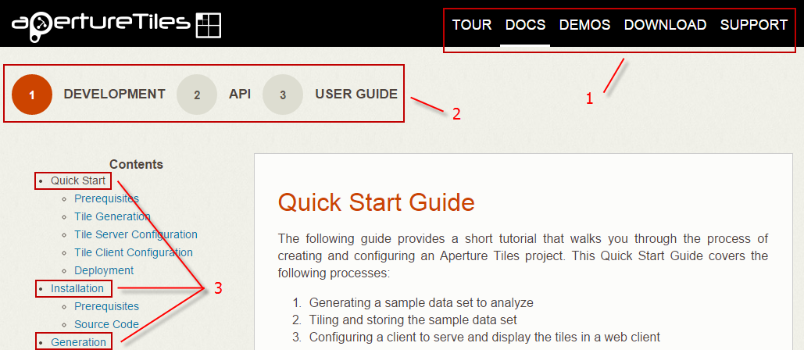

# Building Aperture Sites with Jekyll

Oculus Info's Aperture websites (Aperture JS, Aperture Tiles and Influent) contain detailed documentation for both developers and end users. Each site is built using [Jekyll](http://jekyllrb.com/), a static website generator. All of the website content is written in Markdown (*.md), a plain text formatting syntax, and stored separately from the website layout (HTML) and styles (Sass/CSS). Jekyll generates the sites by parsing the Markdown contents, converting them to HTML and inserting them into the appropriate layout.

You can use Jekyll to build the website source files if you want to:

- Create a local instance of an Aperture website (e.g., if your users do not have access to the Internet)
- Modify the documentation to reflect the functionality of your Influent deployment
- Update the look and feel of the website to match your existing style

Note that the latest versions of the pre-built Aperture website are available for browsing at the following locations:

- Aperture JS: [http://aperturejs.com/](http://aperturejs.com/)
- Aperture Tiles: [https://aperturetiles.com/](https://aperturetiles.com/)
- Influent: [http://influent.org/](http://influent.org/))

## Prerequisites

Before you attempt to build an Aperture site, you should install the following prerequisites. Note that while other versions of the third-party tools below may work, only the listed versions have been tested with the latest site build.

- **Operating System**: Linux, Unix or Mac OS X. (Windows support with [Cygwin](https://www.cygwin.com/) version 1.7.30)
- **Language**:	[Ruby](https://www.ruby-lang.org/) (version 1.9.3) 
	- **Package Manager**: [RubyGems](https://rubygems.org/) (version 1.8.28)
- **Gems**:
	- **Site Generator**: [Jekyll](http://jekyllrb.com/) (version 2.5.1)
	- **Syntax Highlighter**: [Rouge](https://github.com/jneen/rouge) (version 1.6.1)

## Building the Site

To build an Aperture site, run the following command in its source docs folder (which contains a *_config.yml* file):

    jekyll build

By default, Jekyll will compile the site into a `_site` folder one level above the source docs folder. You can change the destination directory using the following command:

    jekyll build –destination <destination>

To test the site before deploying it, you can run the following command, which will build a preview site at http://localhost:4000/:

    jekyll serve

## Aperture Website Configuration

This section describes how the Aperture websites are configured for the Jekyll conversion.

- Markdown Files
- Jekyll Resources

### Markdown Files

Each Markdown file (*.md) covers a single topic representing a page on the Aperture website. There should only be one Markdown file per folder. Each file should be named readme.md so that it is natively displayed in the GitHub repository when viewing the corresponding folder.

All Markdown files must contain a frontmatter section so Jekyll will recognize that they should be converted to HTML. The frontmatter must appear at the top of the file between a set of triple-dashed lines as follows:

    ---
    ---

Between these lines, you can define any number of page-specific variables (NOTE: try to keep the variables to a minimum if possible; they are visible at the top of the page in the GitHub repository). The page-specific variables are invoked in the layouts using the [Liquid templating language](http://docs.shopify.com/themes/liquid-basics). 

The Aperture sites currently use the following page-specific variables:

```
section		(Required)

	Name of the section to which the page belongs. Must match the name of one of
	the links in the main navigation menu (see callout 1 in the following figure).

	This variable is used by Jekyll when:
	-	Defining the page title (as it appears in the browser window or tab)
	-	Determining the navigation bar context
	-	Retrieving the sidebar content

subtitle	 (Required for pages with submenus)

	Name of the subsection to which the page belongs. Must match the name of one
	of the links in the section-specific submenu (see callout 2 in the following
	figure).

	This variable is used by Jekyll when:
	-	Retrieving and outputting the section submenu (and its context)
	-	Retrieving the sidebar content

chapter		(Required for pages in a submenu that represent a chapter)

	Name of the chapter to which the page belongs. Should match the name of one
	of the links in the submenu-specific table of contents (see callout 3 in the
	following figure).

permalink	 (Required)

	The relative path and filename to which the converted HTML should be written.
	Upon conversion, all Markdown files should be renamed to index.html using
	this variable so they are displayed automatically in a web browser when using
	relative paths.
	
layout		(Required)

	Layout used to render the content. Choose from:
	-	section, for pages without submenus
	-	submenu, for pages with submenus
```



### Jekyll Resources

In addition to getting page-specific variables from the Markdown files, Jekyll also gets global variables and assets from the following locations:

```
_config.yml

	File containing Jekyll configuration options such as:

	- The Markdown renderer to use to convert the content. The default renderer 
	  for the Aperture sites is Redcarpet.
	- A product	variable used to display the correct logo and set part of the
      page title (as it appears in the browser window or tab).
	- A baseurl variable that indicates where the root site folder is located. 
	  You do not need to set this variable if you are deploying to your server's
	  root folder

_data

	Folder containing a YAML file (**menuItems.yaml**) that lists each of the 
	items that should appear in the main navigation bar and each of the section-
	specific submenu navigation bars.

	
	Items in the main website header menu should be listed in an array named 
	"main", with each item having a label and a path (with the base URL omitted):

		main:
		  - label: Tour
	   	    path: tour/

		  - label: Docs
			path: docs/development/

		  - label: Demos
			path: demos/

		  - label: Download
			path: download/

	Items in the section-specific submenu navigation bars should follow the
	same format, replacing "main" for the appropriate section label, which
	should match one of the item labels in the main menu and the section
	variables used in the Markdown files for that section.

		docs:
		  - label: Development
			path: docs/development/

		  - label: User Guide
			path: docs/userguide/
	
	Note that the filename should end in *s* (e.g., *menuItems*). To
	reference a single item in a file, call the non-pluralized version of the
	file name followed by the appropriate array name to specify the menu you
	want:
	
		

	Do not use special characters or spaces in the filename.  

_includes

	Contains two types of files:

	-	HTML files for the sidebars that appear on the HTML pages. Must follow
		the naming convention:
	
		{{ page.section }}-{{ page.subtitle }}.html

	-	Other files containing snippets of HTML that appear across all the pages
		(e.g., submenu.html or footer.html).

	These can be invoked using the following format:

		

_layouts

	There are three layouts used to build the site:

	-	default.html: Defines the navigation bar at the top of the website,
		points to the CSS and JS resources and sets the page title. Invoked by
		each of the other layouts.
	-	section.html:  Gets the sidebar for the pages without submenus (using the
		page.section variable). Calls default.html.
	-	submenu.html: Gets the sidebar for the pages with submenus (using the
		page.section and page.subtitle variables) and gets and outputs the
		submenu items. Calls default.html.

	The layouts are written in HTML and utilize Liquid templating language to
	retrieve and manipulate page- and site-specific variables.

_sass

    Contains partial Sass files used to build the final CSS files that apply to
	your site.
_site

	Only created after Jekyll compiles the site. Contains all of the HTML files
	and associated resources.
```