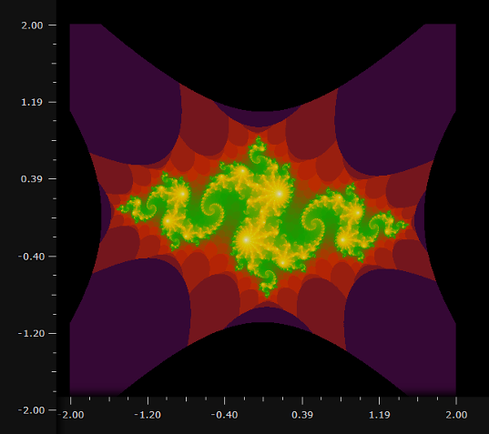

# Quick Start Example Workflow #

This guide, which provides a short tutorial on the process of creating and configuring an Aperture Tiles project, covers the following topics:

1. Generating a sample dataset to analyze
2. Tiling and storing the sample dataset
3. Configuring a client to serve and display the tiles in a web browser

At the end of this guide, you will have an example Aperture Tiles application that displays the points in a Julia set fractal dataset on an X/Y plot with five zoom levels.



## Prerequisites ##

Before beginning this Quick Start example, install the prerequisites described in the [Packaged Distribution](../installation/#packaged-distributions) section of the [Installation](../installation/) topic.

Once you install all the prerequisites, you can generate the [Julia set data](#julia-set-data-generation), from which you will later create a set of tiles that will be used in your Aperture Tiles project.

### Julia Set Data Generation ###

<h6 class="procedure">To use the Tile Generator utility to create the Julia set data</h6>

1. Execute the standard [spark-submit](http://spark.apache.org/docs/1.3.0/submitting-applications.html) script, changing the **output** URI to specify where you want to save the data (HDFS or local file system):

    ```bash
    $SPARK_HOME/bin/spark-submit --class com.oculusinfo.tilegen.examples.datagen
    .JuliaSetGenerator --master local[2] lib/tile-generation-assembly.jar -real 
    -0.8 -imag 0.156 -output datasets/julia -partitions 5 -samples 10000000
    ```

    **NOTE**: The remaining flags pass in the correct program main class, dataset limits, number of output files (5) and total number of data points (10M).

2. Check your output location for 5 part files (**part-00000** to **part-00004**) of roughly equal size (2M records and ~88 MB). These files contain the tab-delimited points in the Julia set.

**NOTE**: For typical Aperture Tiles projects, these steps are unnecessary. You will instead begin with your own custom dataset.

## Tile Generation ##

The first step in building any Aperture Tiles project is to create a set of [Avro](http://avro.apache.org/) tiles that aggregate your source data across the plot/map and its various zoom levels.

To create tiles for delimited numeric data sources like the Julia set, we use the CSVBinner tool. The CSVBinner tool requires two types of input:

- [Base properties file](#base-property-file-configuration), which describes the general characteristics of your data
- [Tiling properties files](#tiling-property-file-configuration), each of which describes a specific attribute you want to plot and the number of zoom levels

### Base Property File Configuration ###

A preconfigured base properties file is available in the Tile Generator utility. You only need to edit this file if you want to save your tiles to HBase. Otherwise, skip ahead to the [execution](#execution) of the tile generation job.

**NOTE**: For a typical Aperture Tiles project, you will edit the additional properties files to define the types of fields in your source data. For more information on these properties, see the [Standard Tiling Jobs](../../how-to/standard-tiling/) topic.

<h6 class="procedure">To edit the base properties file</h6>

1.  Open the **julia-base.bd** file in the Tile Generator *examples/* folder.
2.  Edit the **oculus.binning.source.location** property to specify the location of your Julia set data:
    -   For the local system: */data/julia*
    -   For HDFS: *hdfs://hadoop.example.com/data/julia*
3.  Edit the following general output properties:

    <table class="summaryTable" style="width:100%;">
        <thead>
            <tr>
                <th scope="col" style="width:20%;">Property</th>
                <th scope="col" style="width:80%;">Description</th>
            </tr>
        </thead>
        <tbody>
            <tr>
                <td class="property">oculus.tileio.type</td>
                <td class="description">Specify whether the tiles should be saved locally (<em>file</em>) or to HBase (<em>hbase</em>). Local tile IO is supported only for standalone Spark installations.</td>
            </tr>
            <tr>
                <td class="property">oculus.binning.name</td>
                <td class="description">Specify the name of the output tile set. If you are writing to a file system, use a relative path instead of an absolute path. Use <em>julia</em> for this example.</td>
            </tr>
        </tbody>
    </table>

4.  If you are using Hadoop/HDFS and HBase, edit the following HBase connection details:

    <table class="summaryTable" style="width:100%;">
        <thead>
            <tr>
                <th scope="col" style="width:20%;">Property</th>
                <th scope="col" style="width:80%;">Description</th>
            </tr>
        </thead>
        <tbody>
            <tr>
                <td class="property">hbase.zookeeper.quorum</td>
                <td class="description">Zookeeper quorum location needed to connect to HBase.</td>
            </tr>
            <tr>
                <td class="property">hbase.zookeeper.port</td>
                <td class="description">Port through which to connect to zookeeper. Typically defaults to <em>2181</em>.</td>
            </tr>
            <tr>
                <td class="property">hbase.master</td>
                <td class="description">Location of the HBase master to which to save the tiles.</td>
            </tr>
        </tbody>
    </table>

5.  Save the **julia-base.bd** file.

### Tiling Property File Configuration ###

The Tile Generator utility also contains a tiling properties file (**julia-tiling.bd** in *examples/*). You do not need to edit it.

**NOTE**: For a typical Aperture Tiles project, you will edit the properties file to define the layout of the map/plot on which to project your data. For more information on these properties, see the [Standard Tiling Jobs](../../how-to/standard-tiling/) topic.

### Execution ###

After you edit the properties files, you can use the Tile Generator utility to create the Avro tile set.

<h6 class="procedure">To execute the tile generation job</h6>

1.  Execute the standard **spark-submit** script again, invoking the CSVBinner and using the *-d* switch to pass your edited base properties file. Tiling properties files can be passed in without a switch.

    ```bash
    $SPARK_HOME/bin/spark-submit --class com.oculusinfo.tilegen.examples.apps
    .CSVBinner --master local[2] --driver-memory 1G lib/tile-generation-assembly.jar 
    -d examples/julia-base.bd examples/julia-tiling.bd
    ```

2.  Check your output location (*julia.x.y.v*) for six subfolders, each corresponding to a zoom level (0 through 5 from highest to lowest). Across all the folders, you should have a total of 1,365 Avro tile files.

## Tile Server Configuration ##

The Tile Server renders your generated tiles as layers in your Aperture Tiles visualization and passes them to the client. For this example, a preconfigured example server application is part of the Tile Quick Start Application ([tile-quickstart.war](../../../../download/#tile-quick-start-application)).

<h6 class="procedure">To make tiles on the local file system available to Tile Quick Start Application</h6>

1. Zip the *julia.x.y.v* directory produced during the Tile Generation stage.
2. Copy the ZIP file to the *WEB-INF/classes/* directory of the Tile Quick Start Application.

**NOTE**: For typical Aperture Tiles projects, you will edit the */WEB-INF/***web.xml** and *WEB-INF/classes/***tile.properties** files in the Tile Server. For more information on editing these files, see the [Tile Server](../../how-to/tile-server/) topic.

### Layer Properties ###

Layer properties (within the **tile-quickstart.war** at *WEB-INF/classes/layers/***julia-layer.json**) specify the layers that can be overlaid on your base map or plot.

For this example, you only need to edit the layer properties file if you saved your tiles to HBase. Otherwise, skip ahead to the configuration of the [Tile Client Application](#tile-client-application).

<h6 class="procedure">To edit the layer properties</h6>

1.  Access the *WEB-INF/classes/layers/***julia-layer.json** file.
2.  Make sure the **id** property under the *private* node matches the name given to the HBase table containing your tiles (*julia.x.y.v*).
3.  Clear the existing attributes under the **pyramidio** node and add the following HBase connection details:

    <table class="summaryTable" style="width:100%;">
        <thead>
            <tr>
                <th scope="col" style="width:20%;">Property</th>
                <th scope="col" style="width:80%;">Value</th>
            </tr>
        </thead>
        <tbody>
            <tr>
                <td class="property">type</td>
                <td class="value">hbase</td>
            </tr>
            <tr>
                <td class="property">hbase.zookeeper.quorum</td>
                <td class="description">Zookeeper quorum location needed to connect to HBase. For example:
                    <ul>
                        <li><em>my-zk-server1.example.com</em></li>
                        <li><em>my-zk-server2.example.com</em></li>
                        <li><em>my-zk-server3.example.com</em></li>
                    </ul>
                </td>
            </tr>
            <tr>
                <td class="property">hbase.zookeeper.port</td>
                <td class="description">Port through which to connect to zookeeper. Typically defaults to <em>2181</em>.</td>
            </tr>
            <tr>
                <td class="property">hbase.master</td>
                <td class="description">Location of the HBase master in which the tiles are saved (e.g., <em>my-hbase-master.example.com:60000</em>)</td>
            </tr>
        </tbody>
    </table>

4.  Save the file.

For information on additional layer properties, see the *Layers* section of the [Tile Server](../../how-to/tile-server/#layers) topic.

## Tile Client Application ##

For this example, a preconfigured example client application is part of the Tile Quick Start Application ([tile-quickstart.war](../../../../download/#tile-quick-start-application)). The client displays the base map or plot and any layers passed in from the server.

For information on map properties (e.g., for boundaries and axes), see the *Maps* section of the [Tile Client](../../how-to/tile-client/#map) topic.

## Deployment ##

<h6 class="procedure">To deploy your application</h6>

1. Copy the **tile-quickstart.war** to the *webapps/* directory of your web server (e.g., Apache Tomcat or Jetty).
2. If necessary, restart the server.
3. Access your application in web browser at <em>http://localhost:8080/julia-demo</em>.

The Julia set application data is plotted on an X/Y chart with six layers of zoom available.

## Next Steps ##

For information on the structure of tile pyramids and the processes required to create them, see the [Understanding the Tile Pyramid](../tile-pyramid/) topic.