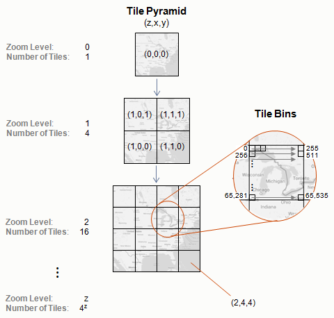
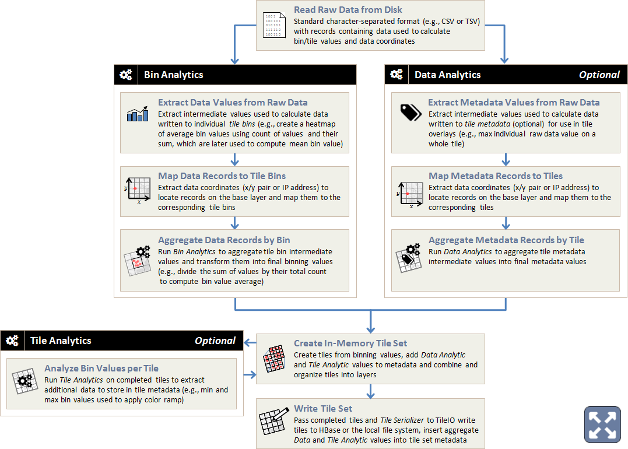

Understanding the Tile Pyramid
==============================

Using a distributed framework built on the [Apache Spark](https://spark.apache.org/) engine, Aperture Tiles enables you to create a set of data tiles that summarize and aggregate your large-scale data at various levels in a interactive, pyramid-style visualization.

## Tile Pyramid Hierarchy ##

At the highest level in the tile set pyramid (level 0), a single tile summarizes all of your data. On each lower level, there are up to *4z* tiles, where *z* is the zoom level (with lower numbers indicating higher levels). At each level, the tiles are laid out row-wise across the base map or plot, starting at the lower left. 

Each tile summarizes the data in the region of the base map/plot to which it corresponds. Tiles are serialized objects partitioned into a variable number of bins (typically 256 x 256 for heatmaps). Each bin contains an aggregation of all the data points in the tile partition it represents.

## Tile Generation Process ##

The process of generating a set of tiles from your raw source data is called a tiling job. The tiles created by a job can be served and browsed in any modern Web browser.

As shown in the following diagram, the tile generation process has five main stages:

1. **Raw Data Parsing**: Pass in your raw data and parse its structure.
   
For standard tiling jobs, this is the main task; the rest of the applicable stages are kicked off automatically.

2. **Bin Analytics**: Create summaries per tile that are partitioned into bins.
    <ol type="a">
        <li><em>Extract</em> intermediate values from the records in your data (e.g., a count of values and their sum).</li>
        <li><em>Map</em> to one tile bin.</li>
        <li><em>Aggregate</em> all the values in each bin (e.g., divide sum by count to get mean value).</li>
        <li><em>Output</em> the final value written to each bin (e.g., mean value).</li>
    </ol>
    
<em>Example Use</em>: Create heatmaps distributed across each zoom level in your tile pyramid.

3. **Data Analytics** (*Optional*)
    <ol type="a">
        <li><em>Extract</em> intermediate values from the records in your data.</li>
        <li><em>Map</em> to one tile.</li>
        <li><em>Aggregate</em> all the values mapped to each tile (e.g., determine the maximum individual raw data value).</li>
        <li><em>Output</em> tile metadata values.</li>
    </ol>
    
<em>Example Use</em>: Create custom tile overlay analytics. Not part of the standard tile generation process.

4. **Tile Analytics** (*Optional*)
    <ol type="a">
        <li><em>Extract</em> additional data tile data.</li>
        <li><em>Map</em> to one tile.</li>
        <li><em>Output</em> tile metadata values.</li>
    </ol>
    
<em>Example Use</em>: Analyze completed tiles and store information to tile metadata (e.g., extract the minimum and maximum bin values, which are used to apply color ramps).

5. **Tile Creation**: Assemble the values generated by the various analytics into a completed tile pyramid, first in memory and then to HBase or the local file system.

Click <a href="https://raw.githubusercontent.com/unchartedsoftware/aperture-tiles/master/docs/src/img/tile-gen-process-lg.png">here</a> to view an expanded diagram

 You can execute the tile generation process on your source data in any of the following manners:

<table class="summaryTable" style="width:100%;">
    <thead>
        <tr>
            <th scope="col" style="width:15%;">Job Type</th>
            <th scope="col" style="width:42%;">Description</th>
            <th scope="col" style="width:43%;">Requirements</th>
        </tr>
    </thead>
    <tbody>
        <tr>
            <td class="description"><a href="../../how-to/standard-tiling">Standard</a></td>
            <td class="description">Uses the built-in CSVBinner tool, which automates generation of tiles that aggregate numeric data by summation or take the minimum or maximum value.</td>
            <td class="description">A set of properties files that describe the source data to analyze and the job options to pass in.</td>
        </tr>

        <tr>
            <td class="description"><a href="../../advanced/custom-tiling">Custom</a></td>
            <td class="description">Uses a set of RDDBinner APIs for creating custom tile-based analytics on non-numeric or non-delimited data.</td>
            <td class="description">Create custom code for some or all of the tile generation stages. See the Twitter Topics demo (<a href="https://github.com/unchartedsoftware/aperture-tiles/tree/master/tile-examples/twitter-topics">tile-examples/<wbr>twitter-topics/</a>) for an example implementation of custom tiling.</td>
        </tr>

        <tr>
            <td class="description"><a href="../../advanced/graph-tiling">Graph</a></td>
            <td class="description">Uses the built-in CSVGraphBinner tool, which automates generation of tiles that aggregate node and edge data.</td>
            <td class="description">A set of properties files that describe the source data to analyze and the job options to pass in.</td>
        </tr>

        <tr>
            <td class="description">Third Party</td>
            <td class="description">Use third-party tools. This approach is not discussed below.</td>
            <td class="description">Adhere to the Aperture Tiles Avro schema. Basic schema files are in the Aperture Tiles source code (<a href="https://github.com/unchartedsoftware/aperture-tiles/tree/master/binning-utilities/src/main/resources">binning-utilities/<wbr>src/<wbr>main/<wbr>resources/</a>).</td>
        </tr>
    </tbody>
</table>

Before you run a tiling job, make sure you meet all of the prerequisites listed in the following section.

## Tiling Job Prerequisites ##

Aperture Tiles uses a distributed framework built on the Apache Spark engine to generate tiles. Before you run a tiling job, you must install and configure the following prerequisites:

- [Scala](http://www.scala-lang.org/) v2.10.3
- [Apache Spark](http://spark.incubator.apache.org/) v1.3

If you intend to work with datasets that cannot fit in the memory of a single machine or if you wish to avoid wait times, we recommend you also install your preferred [Hadoop](http://hadoop.apache.org/) distribution to enable Aperture Tiles to work with particularly large datasets:

- [Cloudera](http://hadoop.apache.org/) v5.4.7 (*recommended*)
- [Apache](http://hadoop.apache.org/docs/r1.2.1/index.html)
- [MapR](http://www.mapr.com/products/apache-hadoop)
- [HortonWorks](http://hortonworks.com/)

For detailed information on Aperture Tiles prerequisites, see the [Installation](../../getting-started/installation/) topic.

<h6 class="procedure">To configure Apache Spark for your installed version of Hadoop</h6>

Perform one of the following actions:

- [Download](http://spark.apache.org/downloads.html) the correct version directly.
- If no version is listed for your flavor of Hadoop, [build](http://spark.apache.org/docs/latest/building-with-maven.html) Spark to support it.

## spark-submit ##

The Aperture Tiles source code relies on the standard [spark-submit](http://spark.apache.org/docs/1.3.0/submitting-applications.html) script to build your tiles. The script simplifies the process of running Spark jobs by including all the necessary libraries and setting various parameters.

## Next Steps ##

For details on running standard tiling jobs, see the [Run Standard Tiling Jobs](../../how-to/standard-tiling) topic.