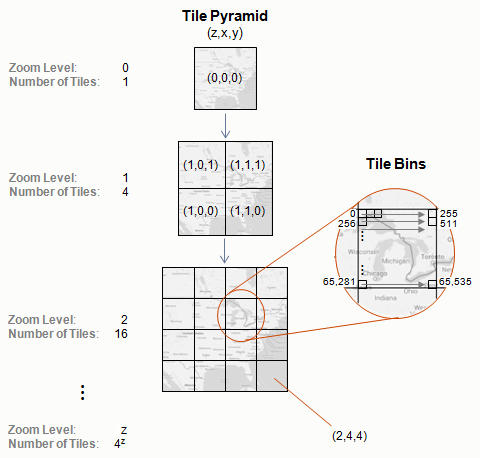

Tile Generation
===============

Using a distributed framework built on the Apache Spark engine, Aperture Tiles enables you to create a set of data tiles that can be used summarize and aggregate your large-scale data at various levels in a interactive, pyramid-style visualization. 

The following sections describe how you can generate a tile pyramid from your raw data using tools built in to the Aperture Tiles source code or by creating your own custom generation code. Also included are instructions for testing the output of your tiling job before you deploy your application.

## <a name="pyramid-hierarchy"></a> Understanding the Tile Pyramid Hierarchy ##

At the highest level in the tile set pyramid (level 0), a single tile summarizes all of your data. On each lower level, there are up to <em>4<sup>z</sup></em> tiles, where *z* is the zoom level (with lower numbers indicating higher levels). At each level, the tiles are laid out row-wise across the base map or plot, starting at the lower left. Each tile summarizes the data in the region of the base map/plot to which it corresponds.

Individual tiles are [Avro](http://avro.apache.org/) record objects partitioned into a variable number of bins (typically 256 x 256 for heatmaps). Each bin contains an aggregation of all the data points in the region of the base map/plot to which it corresponds.



## <a name="tile-gen-process"></a> Tile Generation Process ##

The process of generating a set of Avro tiles from your raw source data is called a tiling job. The tiles created by a job can be served and browsed in any modern Web browser.

As shown in the following diagram, the tile generation process has five main stages:

1. **Raw Data Parsing**
    - *Purpose*: Pass in your raw data and parse its structure. For standard tiling jobs, parsing the raw data is the main task; the rest of the applicable stages are kicked off automatically.
2. **Bin Analytics**
    - *Purpose*: Create summaries per tile that are partitioned into bins.
    - *Extracts*: Intermediate values from the records in your raw data (e.g., a count of values and their sum)
	- *Maps To*: One tile bin
	- *Aggregates*: All the values in each bin (e.g., divide the sum by the count to get the mean value)
    - *Outputs*: Final value written to each bin (e.g., the mean value)
	- *Example Use*: Create heatmaps distributed across each of the zoom levels in your geographic map or cross-plot tile pyramid
3. **Data Analytics** (*Optional*)
    - *Extracts*: Intermediate values from the records in your raw data
	- *Maps To*: One tile
	- *Aggregates*: All the values mapped to each tile (e.g., determine the maximum individual raw data value)
    - *Outputs*: Tile metadata values
	- *Example Use*: Create custom tile overlay analytics. Not part of the standard tile generation process.
4. **Tile Analytics** (*Optional*)
    - *Extracts*: Additional data tile data
	- *Maps To*: One tile
	- *Outputs*: Tile metadata values
	- *Example Use*: Analyze completed tiles and store information to tile metadata (e.g., extract the minimum and maximum bin values, which are used to apply color ramps)
5. **Tile Creation** 
    - *Purpose*: Assembles the values generated by the various analytics into a tile pyramid, first in memory and then to HBase or the local file system
	- *Outputs*: Completed tile pyramid

<a href="diagram.html" class="screenshot"></a>
<div class="git">Click <a href="https://raw.githubusercontent.com/unchartedsoftware/aperture-tiles/develop/docs/src/img/tile-gen-process-lg.png">here</a> to view an expanded diagram</div>

<br>You can execute the tile generation process on your source data in any of the following manners:

- [**Standard tiling jobs**](#csvbinner) use the CSVBinner, a built-in tool that can produce tiles that aggregate numeric data by summation or take the minimum or maximum value. The CSVBinner automates the steps in the tile generation process; all you need to provide is a set of properties files that describe the source data to analyze and the job options to pass in.
- [**Custom tiling jobs**](#custom-tiling) use a set of RDDBinner APIs for creating custom tile-based analytics on non-numeric or non-delimited data. Depending on your implementation, you will need to create custom code for some or all of the tile generation stages. See the Twitter Topics demo (<em>tile-examples/<wbr>twitter-topics</em>) for an example implementation of a data set requiring custom tiling.
- **Third-party tiling jobs** use other tools, provided they adhere to the Aperture Tiles Avro schema. Basic schema files are in the Aperture Tiles source code (<em>binning-utilities/<wbr>src/<wbr>main/<wbr>resources</em>). <p class="list-paragraph"><strong>NOTE</strong>: This approach is not discussed below.</h6>

Before you run a tiling job, make sure you meet all of the prerequisites listed in the following section.

## <a name="prerequisites"></a> Prerequisites ##

Aperture Tiles uses a distributed framework built on the Apache Spark engine to generate Avro tiles. Before you run a tiling job, you must install and configure Apache Spark and its related prerequisites as described in the following sections.

### <a name="third-party-tools"></a> Third-Party Tools ###

See the [Installation](../installation/#prerequisites) topic for full details on required third-party tools.

<div class="props">
	<nav>
		<table class="summaryTable" width="100%">
			<thead >
				<th scope="col" width="20%">Component</th>
				<th scope="col" width="30%">Required</th>
				<th scope="col" width="50%">Notes</th>
			</thead>
			<tr>
				<td style="vertical-align: text-top" class="attributes">Languages</td>
				<td style="vertical-align: text-top" class="nameDescription">
					<div class="description">
						<a href="http://www.scala-lang.org/">Scala</a> v2.10.3
					</div>
				</td>
				<td style="vertical-align: text-top" class="nameDescription">
					<div class="description"></div>
				</td>
			</tr>
			<tr>
				<td style="vertical-align: text-top" class="attributes" rowspan="2">Cluster Computing Framework</td>
				<td style="vertical-align: text-top" class="nameDescription">
					<div class="description">
						<a href="http://spark.incubator.apache.org//">Apache Spark</a><br>v1.0.0+
					</div>
				</td>
				<td style="vertical-align: text-top" class="nameDescription">
					<div class="description">
						<p>You must configure the version of Hadoop with which Spark will be working (if applicable).</p>
							<p>The latest version of Spark may cause class path issues if you compile from source code. We recommend using a pre-built Spark package.</p>
					</div>
				</td>
			</tr>
			<tr>
				<td style="vertical-align: text-top" class="nameDescription">
					<div class="description">
						<a href="http://hadoop.apache.org/">Hadoop</a> (<em>optional</em>):
						<ul>
							<li><a href="http://www.cloudera.com/content/cloudera/en/products-and-services/cdh.html">Cloudera</a>  v4.6 (<em>recommended)</em></li>
							<li><a href="http://hadoop.apache.org/docs/r1.2.1/index.html">Apache</a></li>
							<li><a href="http://www.mapr.com/products/apache-hadoop">MapR</a></li>
							<li><a href="http://hortonworks.com/">HortonWorks</a></li>
						</ul>
					</div>
				</td>
				<td style="vertical-align: text-top" class="nameDescription">
					<div class="description">
						Some Hadoop distributions automatically install Apache Spark. Upgrade to v1.0.0+ if the installation is older.
					</div>
				</td>
			</tr>
		</table>
	</nav>
</div>

### <a name="spark-config"></a> Apache Spark Configuration ###

To configure Apache Spark for your installed version of Hadoop, perform one of the following actions:

- [Download](http://spark.apache.org/downloads.html) the correct version directly.
- If no version is listed for your flavor of Hadoop, [build](http://spark.apache.org/docs/latest/building-with-maven.html) Spark to support it.

The Aperture Tiles source code relies on the standard [spark-submit](http://spark.apache.org/docs/1.0.0/submitting-applications.html) script to help you build your tiles. The script simplifies the process of running Spark jobs by including all the necessary libraries and setting various parameters.

## <a name="csvbinner"></a> Standard Tiling Jobs ##

A standard Aperture Tiles tiling job uses the CSVBinner tool in the source code to process your numeric, character-separated (e.g., CSV) tabular data and generate a set of tiles. To define the tile set you want to create, you must edit two types of properties files and pass them to the CSVBinner:

- A [base properties](#base-properties) file, which describes the general characteristics of the data
- [Tiling properties](#tiling-properties) files, each of which describes the specific attributes you want to tile

During the tiling job, the CSVBinner creates a collection of Avro tile data files in the location (HBase or local file system) specified in the base properties file.

The following sections describe how to execute the CSVBinner and edit the configurable components of the base properties and tiling properties files.

### Executing the CSVBinner ###

To execute the CSVBinner and run a tiling job, use the **spark-run** script and pass in the names of the properties files you want to use. For example:

```bash
spark-submit --class com.oculusinfo.tilegen.examples.apps.CSVBinner 
lib/tile-generation-assembly.jar -d /data/twitter/dataset-base.bd 
/data/twitter/dataset.lon.lat.bd
```

Where the `-d` switch specifies the base properties file path, and each subsequent file path specifies a tiling properties file.

### <a name="base-properties"></a> Base Properties Files ###

The base properties file describes the tiling job, the systems on which it will run and the general characteristics of the source data. The following properties must be defined in the file:

- [Tile Storage](#tile-storage)
- [HBase Connection](#hbase-connection)
- [Source Data](#source-data)

#### <a name="tile-storage"></a> Tile Storage ####

The tile storage properties indicate whether the tile set created from your source data should be stored in HBase or your local file system:

<div class="details props">
	<div class="innerProps">
		<ul class="methodDetail" id="MethodDetail">
			<dl class="detailList params">
				<dt>oculus.tileio.type</dt>
				<dd>
					Location to which tiles are written:
					<dl>
						<dt>hbase</dt>
						<dd>Writes to HBase. See the <a href="#hbase-connection">HBase Connection</a> section below for further HBase configuration properties</dd>
						<dt>file</dt>
						<dd>Writes to the local file system. This is the default.</dd>
					</dl>
				</dd>
				
				<dt>
					user (Optional)
				</dt>
				<dd>Username passed to the Spark job title. Defaults to the username of the current user.</dd>
			</dl>
		</ul>
	</div>
</div>

#### <a name="hbase-connection"></a> HBase Connection ####

If you chose to store your tile set in HBase (i.e., **oculus.tileio.type** is set to *hbase*), these properties define how to connect to HBase:

<div class="details props">
	<div class="innerProps">
		<ul class="methodDetail" id="MethodDetail">
			<dl class="detailList params">
				<dt>
					hbase.zookeeper.quorum
				</dt>
				<dd>Zookeeper quorum location needed to connect to HBase.</dd>
				
				<dt>
					hbase.zookeeper.port
				</dt>
				<dd>Port through which to connect to zookeeper.</dd>
   
				<dt>
					hbase.master
				</dt>
				<dd>Location of the HBase master to which to write tiles.</dd>
			</dl>
		</ul>
	</div>
</div>

#### <a name="source-data"></a> Source Data ####

The Source Data properties describe the raw data from which you want to create tiles:

<div class="details props">
	<div class="innerProps">
		<ul class="methodDetail" id="MethodDetail">
			<dl class="detailList params">
				<dt>
					oculus.binning.source.location
				</dt>
				<dd>Path (local file system or HDFS) to the source data file or files to be tiled.</dd>
				
				<dt>
					oculus.binning.prefix (Optional)
				</dt>
				<dd>Prefix to be added to the name of every pyramid location. Used to separate this tile generation from previous runs. If not present, no prefix is used.</dd>
   
				<dt>
					oculus.binning.parsing.separator
				</dt>
				<dd>Character or string used as a separator between columns in the input data files. Default is a tab.</dd>
   
				<dt>
					oculus.binning.parsing.&lt;field&gt;.index
				</dt>
				<dd>Column number of the described field in the input data files. This field is mandatory for every field type to be used.</dd>
   
				<dt>
					oculus.binning.parsing.&lt;field&gt;.fieldType
				</dt>
				<dd>Type of value expected in the column specified by:
				<br><strong>oculus.binning.parsing.&lt;field&gt;.index</strong>.
				
				<br><br>By default columns are treated as containing real, double-precision values. Other possible types are:
   
				<dl>
					<dt>constant or zero</dt>
					<dd>Contains <em>0.0</em> (the column does not need to exist)</dd>
					
					<dt>int</dt>
					<dd>Contains integers</dd>
					
					<dt>long</dt>
					<dd>Contains double-precision integers</dd>
					
					<dt>date</dt>
					<dd>Contains dates. Dates are parsed and transformed into milliseconds since the standard Java start date (using SimpleDateFormatter). The default format is <em>yyMMddHHmm</em>, but this can be overridden using the <strong>oculus.binning.parsing.&lt;field&gt;.dateFormat</strong> property.</dd>
			
					<dt>boolean</dt>
					<dd>Contains boolean values (e.g., <em>true/false</em>, <em>yes/no</em>)</dd>
					
					<dt>byte</dt>
					<dd>Contains bytes</dd>
					
					<dt>short</dt>
					<dd>Contains short integers</dd>
					
					<dt>float</dt>
					<dd>Contains floating-point numbers</dd>
					
					<dt>ipv4</dt>
					<dd>Contains an IP address treated as a four-digit base 256 number turned into a double</dd>

					<dt>string</dt>
					<dd>Contains a string value</dd>
			
					<dt>propertyMap</dt>
					<dd>Contains property maps. All of the following properties must be	present	to read the property:
						<dl>
							<dt>oculus.binning.parsing.&lt;field&gt;.property</dt>
							<dd>Name of the property</dd>
							
							<dt>oculus.binning.parsing.&lt;field&gt;.propertyType</dt>
							<dd>Equivalent to fieldType</dd>
							
							<dt>oculus.binning.parsing.&lt;field&gt;.propertySeparator</dt>
							<dd>Character or string used to separate properties</dd>
							
							<dt>oculus.binning.parsing.&lt;field&gt;.propertyValueSeparator</dt>
							<dd>Character or string used to separate property keys from their values</dd>
						</dl>
					</dd>
				</dl>
				</dd>
				
				<dt>
					oculus.binning.parsing.&lt;field&gt;.fieldScaling
				</dt>
				<dd>How field values should be scaled. The default leaves values as they are. Other possibilities are:				
					<dl>
						<dt>log</dt>
						<dd>take the log of the value (<strong>oculus.binning.parsing.&lt;field&gt;.fieldBase</strong> is used, just as with fieldAggregation)</dd>
					</dl>
				</dd>
				
				<dt>
					oculus.binning.parsing.&lt;field&gt;.fieldAggregation
				</dt>
				<dd>Method of aggregation used on values of the X field. Describes how values from multiple data points in the same bin should be aggregated together to create a single value for the bin.

				<br><br>The default is addition.  Other possible aggregation types are:
				
				<dl>
					<dt>min</dt>
					<dd>Find the minimum value</dd>
					
					<dt>max</dt>
					<dd>Find the maximum value</dd>
					
					<dt>log</dt>
					<dd>Treat the number as a logarithmic value; aggregation of a and b is log_base(base^a+base^b). Base is taken from property <strong>oculus.binning.parsing.&lt;field&gt;.fieldBase</strong>, and defaults to <em>e</em>.</dd>
				</dd>
			</dl>
		</ul>
	</div>
</div>

### <a name="tiling-properties"></a> Tiling Properties Files ###

The tiling properties files define the tiling job parameters for each layer in your visual analytic, such as which fields to bin on and how values are binned:

<div class="details props">
	<div class="innerProps">
		<ul class="methodDetail" id="MethodDetail">
			<dl class="detailList params">
				<dt>
					oculus.binning.name
				</dt>
				<dd>Name (path) of the output data tile set pyramid. If you are writing to a file system, use a relative path instead of an absolute path. If you are writing to HBase, this is used as a table name. This name is also written to the tile set metadata and used as a plot label.</dd>
				
				<dt>
					oculus.binning.projection
				</dt>
				<dd>Type of projection to use when binning data. Possible values are:
					<dl>
						<dt>EPSG:4326</dt>
						<dd>Bin linearly over the whole range of values found (default)</dd>
						
						<dt>EPSG:900913</dt>
						<dd>Web-mercator projection (used for geographic values only)</dd>
					</dl>
				</dd>
   
   				<dt>
   					oculus.binning.projection.autobounds
   				</dt>
				<dd>
					Indicates whether the tiling job should set the minimum and maximum	bounds automatically (<em>true</em>, which is the default value) or whether you will specify them manually (<em>false</em>). If set to <em>false</em>, you must also specify:
					<dl>
						<dt>
							oculus.binning.projection.minx
						</dt>
						<dd>
							Indicates the lowest value that will be displayed on the x-axis.
						</dd>
			
						<dt>
							oculus.binning.projection.maxx
						</dt>
						<dd>
							Indicates the highest value that will be displayed on the x-axis.
						</dd>
			
						<dt>
							oculus.binning.projection.miny
						</dt>
						<dd>
							Indicates the lowest value that will be displayed on the y-axis.
						</dd>
			
						<dt>
							oculus.binning.projection.maxy
						</dt>
						<dd>
							Indicates the highest value that will be displayed on the y-axis.
						</dd>
					</dl>
   				</dd>
				
				<dt>
					oculus.binning.index.type
				</dt>
				<dd>Defines the index scheme used to locate the binning value on the base layer and map them to the corresponding tile bins. The value you select determines the number of index fields you must specify:
					<dl>
						<dt>cartesian (default)</dt>
						<dd>
							Use cartesian (x/y) coordinates:
							<ul>
								<li>oculus.binning.index.field.0=&lt;x_Field&gt;</li>
								<li>oculus.binning.index.field.1=&lt;y_Field&gt;</li>
							</ul>

						</dd>
						
						<dt>ipv4</dt>
						<dd>
							Use an IP address (v4):
							<ul>
								<li>oculus.binning.index.field.0=&lt;IPv4_Field&gt;</li>
							</ul>
						</dd>
						
						<dt>timerange</dt>
						<dd>
							Use a standard time range and cartesian point index:
							<ul>
								<li>oculus.binning.index.field.0=&lt;time_Field&gt;</li>
								<li>oculus.binning.index.field.1=&lt;x_Field&gt;</li>
								<li>oculus.binning.index.field.2=&lt;y_Field&gt;</li>
							</ul>
						</dd>
						
						<dt>segment</dt>
						<dd>
							Use a line segment with two cartesian end points:
							<ul>
								<li>oculus.binning.index.field.0=&lt;x1_Field&gt;</li>
								<li>oculus.binning.index.field.1=&lt;y1_Field&gt;</li>
								<li>oculus.binning.index.field.2=&lt;x2_Field&gt;</li>
								<li>oculus.binning.index.field.3=&lt;y2_Field&gt;</li>
							</ul>
						</dd>						
					</dl>
				</dd>

				<dt>
					oculus.binning.index.field.&lt;order&gt;
				</dt>
				<dd>Field(s) to use as the index that locates the binning value on the base layer and map them to the corresponding tile bins. Your index scheme will determine how many index fields you must provide:
					<dl>
						<dt>ipv4</dt>
						<dd>
							<ul>
								<li>oculus.binning.index.field.0=&lt;IPv4_Field&gt;</li>
							</ul>
						</dd>
						
						<dt>cartesian</dt>
						<dd>
							<ul>
								<li>oculus.binning.index.field.0=&lt;x_Field&gt;</li>
								<li>oculus.binning.index.field.1=&lt;y_Field&gt;</li>
							</ul>
						</dd>
						
						<dt>timerange</dt>
						<dd>
							<ul>
								<li>oculus.binning.index.field.0=&lt;time_Field&gt;</li>
								<li>oculus.binning.index.field.1=&lt;x_Field&gt;</li>
								<li>oculus.binning.index.field.2=&lt;y_Field&gt;</li>
							</ul>
						</dd>
						
						<dt>segment</dt>
						<dd>
							<ul>
								<li>oculus.binning.index.field.0=&lt;x1_Field&gt;</li>
								<li>oculus.binning.index.field.1=&lt;y1_Field&gt;</li>
								<li>oculus.binning.index.field.2=&lt;x2_Field&gt;</li>
								<li>oculus.binning.index.field.3=&lt;y2_Field&gt;</li>
							</ul>
						</dd>						
					</dl>
				</dd>
				
				<dt>
					oculus.binning.value.field
				</dt>
				<dd>Field to use as the bin value. Default counts entries only.</dd>
				
				<dt>
					oculus.binning.levels.&lt;order&gt;
				</dt>
				<dd>Array property. For example, if you want to generate tile zoom levels in three groups, you should include:
					<ul>
						<li>oculus.binning.levels.0
						<li>oculus.binning.levels.1
						<li>oculus.binning.levels.2
					</ul>
					
					<p>Each group is a description of the zoom levels to bin simultaneously - a comma-separated list of individual integers, or ranges of integers (described as start-end). For examples, "0-3,5" means levels 0, 1, 2, 3, and 5. If there are multiple level sets, the raw data is parsed once and cached for use with each level set. This property is mandatory, and has no default.</p>
				
					<p>Which levels you should bin together depends both on the size of your cluster and data.</p>
   
					<p>Each binning job has an overhead cost and a tiling cost. Generally, the			overhead cost is the dominant factor below level 8 and irrelevant above that. Tiling all levels below this point will save the overhead cost and reduce tile generation time. Above this level, you risk job failure out of memory errors if you try to simultaneously bin multiple levels due to the large number of tiles generated at lower levels.</p>
				
					<p>Our typical use case has:</p>
				
					<ul>
						<li>binning.level.0=0-8</li>
						<li>binning.level.1=9</li>
						<li>binning.level.2=10</li>
						<li>etc.</li>
					</ul>
				</dd>
				
				<dt>
					oculus.binning.consolidationPartitions
				</dt>
				<dd>The number of partitions into which to consolidate data when binning. If not included, Spark automatically selects the number of partitions.</dd>
				
			</dl>
		</ul>
	</div>
</div>

## <a name="custom-tiling"></a> Custom Tiling Jobs ##

If your source data is not character delimited or if it contains non-numeric fields, you may need to create custom code to parse it and create a tile set. In general, creating custom tile generation code involves the following processes:

- [Defining Your Data Structure](#define-data-structure), which includes some components of the Bin Analytics and Tile Creation stages of the [tile generation process](#tile-gen-process):
	- Structure of your source data while it is being processed by the tiling job and while it is being written to the Avro tile set
	- Aggregation methods used to combine multiple records from your source data that fall in the same tile bin
	- Methods of reading and writing to the tile set
- [Binning Your Data](#binning-your-data), which includes the remaining components of the Bin Analytics and Tile Creation stages of the [tile generation process](#tile-gen-process):
	- Method of parsing your source data into the Avro tile set structure you defined
	- Transformation of your source data into the Avro tile set
	- Storage of the Avro tile set to your preferred location

Once you have created the required components to perform each process, you should run your custom binner. The binner will create the Avro tile set you will use in your Aperture Tiles visual analytic.

An example of custom code written for tile generation can be found in the Twitter Topics project (<em>tile-examples/<wbr>twitter-topics/</em>), which displays a Twitter message heatmap and aggregates the top words mentioned in tweets for each tile and bin.

### <a name="define-data-structure"></a> Defining Your Data Structure ###

The first step in creating custom code for the tile generation process is to decide how your data should be structured, aggregated and written. The following modules are required for this step:

- [Binning Analytic](#binning-analytic), which defines how to process and aggregate your source data 
- [Serializer](#serializer), which defines how to read and write your source data to the tile set

#### <a name="binning-analytic"></a> Binning Analytic ####

The Binning Analytic is used throughout the tiling process. It should define:

- The [data types](#data-types) used during the tiling job, of which there are two formats: a processing type and a binning type.
- The method of [aggregation](#data-aggregation) for joining individual data records in a bin
 
See the following file for an example of a custom Bin Analytic: <em>/tile-examples/twitter-topics/twitter-topics-utilities/src/main/scala/com/oculusinfo/twitter/tilegen/<wbr><strong>TwitterTopicBinningAnalytic.scala</strong></em>

##### <a name="data-types"></a> Data Types #####

During a tiling job, the Binning Analytic uses two types of data:

- A **processing type**, which is used when processing the tiles and aggregating them together. It should contain all the information needed for calculations performed during the job. The processing type allows you to keep information that may be needed for aggregation, but not needed once the tile is complete.
- A **binning type**, which is the final form written to the tile bins.

For example, to record an average, the two types might be used as follows:

1. The processing type would include the count of records and the sum of their values, both of which would be continuously updated as new records are examined.
2. The binning type would simply be the average, or the final processing type sum divided by the total count of records.

A code example is shown in line 40 of **TwitterTopicBinningAnalytic.scala**:

```scala
extends BinningAnalytic[Map[String, TwitterDemoTopicRecord], 
					    JavaList[TwitterDemoTopicRecord]]
```

Here the processing type is a *map* used to add all similar Twitter message topic records together, while the binning type is a *list* containing only the topics with the highest counts.

###### Transformation ######

The Binning Analytic should also describe how to convert the processing type into the binning type. In **TwitterTopicBinningAnalytic.scala**, this is accomplished with a **finish** function (lines 64-65):

```scala
def finish (value: Map[String, TwitterDemoTopicRecord]): JavaList[TwitterDemoTopicRecord] =
	value.values.toList.sortBy(-_.getCountMonthly()).slice(0, 10).asJava
```

The **finish** function:

1. Examines the processing type, which maps Twitter message topics to topic records.
2. Finds the 10 most used topics from the complete processing type map.
3. Stores the 10 most used topic records in an ordered list for each tile.

While the rest of the topics are discarded, they were necessary during processing (e.g., so as to not lose a topic that was eleventh on several different machines -- and hence in the top ten overall).

##### <a name="data-aggregation"></a> Data Aggregation and Record Creation #####

The Binning Analytic defines how data is aggregated. For example, lines 42-47 of **TwitterTopicBinningAnalytic.scala** compare two maps and creates a new map that contains:

- Keys that exist in either map 
- The sum of the their values

```scala
def aggregate (a: Map[String, TwitterDemoTopicRecord],
	           b: Map[String, TwitterDemoTopicRecord]): Map[String, TwitterDemoTopicRecord] = {
	a ++ b.map{case (k, v) =>
		k -> a.get(k).map(TwitterDemoTopicRecord.addRecords(_, v)).getOrElse(v)
	}
}
```

###### <a name="custom-aggregation"></a> Custom Aggregation Methods ######

Lines 85-93  of **TwitterTopicBinner.scala** (found in the same folder as the Binning Analytic) are used to calculate the minimum and maximum values and write them to the metadata by level. 

```scala
val minAnalysis:
		AnalysisDescription[TileData[JavaList[TwitterDemoTopicRecord]],
							List[TwitterDemoTopicRecord]] =
	new TwitterTopicListAnalysis(new TwitterMinRecordAnalytic)

val maxAnalysis:
		AnalysisDescription[TileData[JavaList[TwitterDemoTopicRecord]],
							List[TwitterDemoTopicRecord]] =
	new TwitterTopicListAnalysis(new TwitterMaxRecordAnalytic)
```

Standard Bin Analytics are available in: <em>tile-generation/<wbr>src/<wbr>main/<wbr>scala/<wbr>com/<wbr>oculusinfo/<wbr>tilegen/<wbr>tiling/<wbr>analytics/<wbr><strong>Analytics.scala</strong></em>

#### <a name="serializer"></a> Serializer ####

The Serializer determines how to read and write to the tile set. The Tile Server requires the following supporting classes to use the Serializer:

- [Serializer](#serializer-class)
- [Serialization Factory](#serialization-factory)
- [Serialization Factory Module](#serialization-factory-module)

See the following sections for examples of each custom Serializer component.

##### <a name="serializer-class"></a> Serializer #####

The Serializer implements the <strong>com.<wbr>oculusinfo.<wbr>binning.<wbr>io.<wbr>serialization.<wbr>TileSerializer</strong> interface. To read and write the Avro tiles that are most commonly used, it should inherit from:

- <strong>com.<wbr>oculusinfo.<wbr>binning.<wbr>io.<wbr>serialization.<wbr>GenericAvroSerializer</strong> if your bin type is a single record 
- <strong>com.<wbr>oculusinfo.<wbr>binning.<wbr>io.<wbr>serialization.<wbr>GenericAvroArraySerializer</strong> if your bin type is an array of records record. 

An example of a serializer of tiles whose bins are an array of records is available in: <em>/tile-examples/twitter-topics/twitter-topics-utilities/src/main/java/com/oculusinfo/<wbr>twitter/binning/TwitterTopicAvroSerializer.java</em>

This class inherits from the **GenericAVROArraySerializer.java** (<em>/binning-utilities/src/main/java/com/oculusinfo/binning/io/serialization/</em>) and defines:

- **getEntrySchemaFile**, which points to a file containing the Avro description of a single record
- **setEntryValue**, which sets the value of one entry in the list from the Avro file
- **getEntryValue**, which retrieves the value of one entry in the list from the Avro file

The definition of the Avro schema is located in the following folder, where the **name** is set to *entryType*.

<p><em>/tile-examples/twitter-topics/twitter-topics-utilities/src/main/resources/<wbr><strong>twitterTopicEntry.avsc</strong></em></p>

For records that aren't list types, inherit from the **GenericAvroSerializer.java** (<em>/binning-utilities/src/main/java/com/oculusinfo/binning/io/<wbr>serialization/</em>) and define:

- **getRecordSchemaFile**
- **getValue**
- **setvalue**

The definition of the Avro schema can be based on the template in the following folder, where the **name** is set to *recordType*.

<p><em>/binning-utilities/<wbr>src/<wbr>main/<wbr>resources/<wbr><strong>doubleData.avsc</strong></em></p>

##### <a name="serialization-factory"></a> Serialization Factory #####

The Serialization Factory gets configuration information (e.g., the Avro compression codec) and hands back the serializer of choice when needed. It also produces the factory and can be injected by Guice.

<p><em>/tile-examples/<wbr>twitter-topics/<wbr>twitter-topics-utilities/<wbr>src/<wbr>main/<wbr>java/<wbr>com/<wbr>oculusinfo/<wbr>twitter/<wbr>init/<strong>TwitterTileSerializationFactory.java</strong></em></p>

##### <a name="serialization-factory-module"></a> Serialization Factory Module #####

The Factory Module tells Guice which factory providers to use to create serialization factories.

<p><em>/tile-examples/<wbr>twitter-topics/<wbr>twitter-topics-utilities/<wbr>src/<wbr>main/<wbr>java/<wbr>com/<wbr>oculusinfo/<wbr>twitter/<wbr>init/<wbr><strong>TwitterSerializationFactoryModule.java</strong></em></p>

### <a name="binning-your-data"></a> Binning Your Data ###

There are three steps in binning your data:

1. Parsing your data into the form required by the Binner
2. Running the Binner to transform the data into tiles
3. Writing the tiles

See the following file for an example of a custom Binner: <em>/tile-examples/<wbr>twitter-topics/<wbr>twitter-topics-utilities/<wbr>src/<wbr>main/<wbr>scala/<wbr>com/<wbr>oculusinfo/<wbr>twitter/<wbr>tilegen/<wbr><strong>TwitterTopicBinner.scala</strong></em>

#### <a name="parsing-data"></a> Parsing your Data ####

The Binner expects your data as pairs of **(index, record)**, where:

- **index** is an object indicating where in space the record lies
- **record** is a data record of the processing type your Binning Analytic defines

There are several predefined index types defined in: <em>/tile-generation/<wbr>src/<wbr>main/<wbr>scala/<wbr>com/<wbr>oculusinfo/<wbr>tilegen/<wbr>tiling/<wbr><strong>IndexingScheme.scala</strong></em>

- Cartesian: the index type is a pair of doubles.
- IPv4: the index type is an array of 4 bytes: the 4 values in an IPv4 address.
- Time Range: the index type is three doubles, one that represents the time and two that represent cartesian coordinates

The end result of your parsing will therefore be:

```scala
val data: RDD[((Double, Double), PROCESSING_TYPE)]
```

Where **PROCESSING_TYPE** is the processing type from your [Binning Analytic](#binning-analytic).

Lines 149 - 164 in **TwitterTopicBinner.scala** retrieve the raw data from the Record Parser and create a mapping from (longitude, latitude) pairs to Twitter topic records.

```scala
val data = rawDataWithTopics.mapPartitions(i =>
	{
		val recordParser = new TwitterTopicRecordParser(endTimeSecs)
		i.flatMap(line =>
			{
				try {
					recordParser.getRecordsByTopic(line)
				} catch {
					// Just ignore bad records, there aren't many
					case _: Throwable => Seq[((Double, Double), Map[String, TwitterDemoTopicRecord])]()
				}
			}
		)
	}
).map(record => (record._1, record._2, dataAnalytics.map(_.convert(record))))
data.cache
```

#### <a name="binning"></a> Binning ####

Lines 191 - 199 of **TwitterTopicBinner.scala** transform the data into tiles:

```scala
val tiles = binner.processDataByLevel(data,
				                      new CartesianIndexScheme,
				                      new TwitterTopicBinningAnalytic,
				                      tileAnalytics,
				                      dataAnalytics,
				                      tilePyramid,
				                      levelSet,
				                      xBins=1,
				                      yBins=1)
```

**Binner.processDataByLevel** is defined in the following file on line 230: <em>/tile-generation/<wbr>src/<wbr>main/<wbr>scala/<wbr>com/<wbr>oculusinfo/<wbr>tilegen/<wbr>tiling/<wbr><strong>RDDBinner.scala</strong></em>

It accepts the following properties:

<div class="details props">
	<div class="innerProps">
		<ul class="methodDetail" id="MethodDetail">
			<dl class="detailList params">
				<dt>
					data
				</dt>
				<dd>A distributed collection of (index, record) pairs as described above.</dd>
				
				<dt>
					indexScheme
				</dt>
				<dd>Used to convert the index to a set X/Y coordinates that can be plotted.	When using a CartesianIndexScheme, the coordinates are taken as given.</dd>
	
				<dt>
					binAnalytic
				</dt>
				<dd>A Binning Analytic that, as described above, defines how to aggregate two records, convert them into the form written and determine the extrema of the dataset.</dd>
	
				<dt>
					tileAnalytics
				</dt>
				<dd>Analytics used to perform custom aggregations on tile data (e.g., get the minimum and maximum values) and write them to the metadata by level.</dd>
	
				<dt>
					dataAnalytics
				</dt>
				<dd>Analytics used to perform custom aggregations on raw data that would otherwise be lost by the processing type (e.g., recording the maximum individual value) and write them to the metadata by level.</dd>
	
				<dt>
					tileScheme
				</dt>
				<dd>The projection to use to transform from the raw data index into tiles and bins. Two types are predefined:
					<ul>
						<li><em>/binning-utilities/src/main/java/com/oculusinfo/binning/impl/AOITilePyramid</em>, which is a linear transformation into an arbitrarily sized space
						<li><em>/binning-utilities/src/main/java/com/oculusinfo/binning/impl/WebMercatorTilePyramid</em>, which is a standard geographical projection
					</ul>
				</dd>

				<dt>
					levels
				</dt>
				<dd>Specifies which levels to process at the same time. It is generally recommended you process levels 1-9 together, then run additional levels	one	at a time afterward. This arrangement typically makes effective use of system resources.</dd>
	
				<dt>
					xBins (Optional)
				</dt>
				<dd>Number of bins on the x-axis.  Defaults to 256</dd>
				
				<dt>
					yBins (Optional)
				</dt>
				<dd>Number of bins on the y-axis.  Defaults to 256</dd>
				
				<dt>
					consolidationPartitions (Optional)
				</dt>
				<dd>The number of reducers to use when aggregating data records into bins and tiles. Defaults to the same number of partitions as the original data set. Alter if you encounter problems with the tiling job due to lack of resources.</dd>

				<dt>
					tileType (Optional)
				</dt>
				<dd>A specification of how data should be stored, <em>sparse</em> or <em>dense</em>. If not specified, a heuristic will use the optimal type for a double-valued tile. For significantly larger-valued types, <em>sparse</em> is recommended.</dd>

			</dl>
		</ul>
	</div>
</div>

#### <a name="writing-tiles"></a> Writing Tiles ####

Lines 200 - 207 of **TwitterTopicBinner.scala** specify how to write the tiles created from your transformed data.

```scala
tileIO.writeTileSet(tilePyramid,
				    pyramidId,
				    tiles,
				    new TwitterTopicAvroSerializer(CodecFactory.bzip2Codec()),
				    tileAnalytics,
				    dataAnalytics,
				    pyramidName,
				    pyramidDescription)
```

**tileIO.writeTileSet** is defined in the following file on line 172: <em>/tile-generation/src/main/scala/com/oculusinfo/tilegen/tiling/<strong>RDDBinner.scala</strong></em>

It accepts the following properties:

<div class="details props">
	<div class="innerProps">
		<ul class="methodDetail" id="MethodDetail">
			<dl class="detailList params">
				<dt>
					tileScheme
				</dt>
				<dd>Type of projection built from the set of bins and levels. Must match the tileScheme specified in binner.processDataByLevel.</dd>
				
				<dt>
					writeLocation
				</dt>
				<dd>The ID to apply to the tile set when writing it. If writing to the local filesystem, this will be the base directory into which to write the tiles.	If writing to HBase, it will be the name of the table to write.</dd>
	
				<dt>
					tiles
				</dt>
				<dd>The binned data set produced by binner.processDataByLevel.</dd>
				
				<dt>
					serializer
				</dt>
				<dd>The serializer that determines how to read and write to the tile set.</dd>
	
				<dt>
					tileAnalytics (Optional)
				</dt>
				<dd>Analytics used to perform custom aggregations on tile data (e.g., get the minimum and maximum values) and write them to the metadata by level.</dd>
	
				<dt>
					dataAnalytics (Optional)
				</dt>
				<dd>Analytics used to perform custom aggregations on raw data that would otherwise be lost by the processing type (e.g., recording the maximum individual value) and write them to the metadata by level.</dd>
	
				<dt>
					name
				</dt>
				<dd>Name of the finished pyramid. Stored in the tile metadata.</dd>
				
				<dt>
					description
				</dt>
				<dd>Description of the finished pyramid. Stored in the tile metadata.</dd>
				
			</dl>
		</ul>
	</div>
</div>

## <a name="bin-visualizer"></a> Testing the Output of Your Tiling Jobs ##

A utility for testing the output of tiling jobs is included in the Aperture Tiles source code. The Bin Visualizer, which can be run as a Java application, displays basic visual representations of the individual Avro tiles in your tile set pyramid. This can help you quickly identify problems with your tiling job before you deploy your application. The Bin Visualizer currently only supports heatmap layers.

To use the Bin Visualizer:

1. In an integrated development environment, browse to *binning-utilities/<wbr>src/<wbr>main/<wbr>java/<wbr>com/<wbr>oculusinfo/<wbr>binning/<wbr>visualization/<wbr>***BinVisualizer.java**.
2. Debug the utility as a Java application.
3. Specify the location (e.g., HBase or local file system) in which you stored your Avro tiles using the **I/O** type drop-down list.
    - For HBase connections, enter the appropriate **Zookeeper quorum**, **Zookeeper port** and **HBase master** information.
    - For the local file system, specify the **Root path** and **Tile extension** (defaults to *avro*).
4. Enter the name of the tile pyramid you want to view in the **Pyramid id** field.
5. Set the following coordinates to choose the individual tile you want to view:
    - **Zoom level**, where 0 is the highest level (most zoomed out)
	- **Tile x coordinate**, where 0 is the leftmost column of tiles
	- **Tile y coordinate**, where 0 is the bottommost row of tiles
6. Click **Show tile**.


## Next Steps ##

For details on configuring a tile server and client to create a tile-based visual analytic application, see the [Configuration](../configuration) topic.