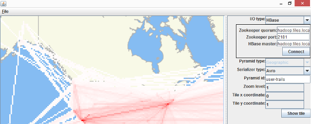
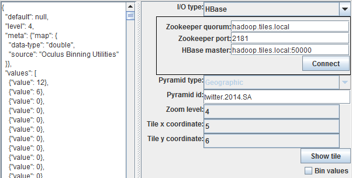

Testing Tiling Job Output
=========================

The Aperture Tiles source code contains two utilities for testing the output of tiling jobs. Both utilities are Java applications that can help you quickly identify problems with your tiling job before you deploy your application.

- [Bin Visualizer](#bin-visualizer): Renders basic representations of individual Avro tiles in your tile pyramid.
- [JSON Tile Visualizer](#json-tile-visualizer): Generates a list of data or bin values that appear in individual Avro tiles in your tile pyramid.

If you notice any inconsistencies with the tiled data, you should review your tiling job parameters, fix any errors and run the job again.

## Bin Visualizer ##

The [BinVisualizer.java](https://github.com/unchartedsoftware/aperture-tiles/blob/master/binning-utilities/src/main/java/com/oculusinfo/binning/visualization/BinVisualizer.java) file in [binning-utilities/<wbr>src/<wbr>main/<wbr>java/<wbr>com/<wbr>oculusinfo/<wbr>binning/<wbr>visualization/](https://github.com/unchartedsoftware/aperture-tiles/tree/master/binning-utilities/src/main/java/com/oculusinfo/binning/visualization) allows you to preview tiling job output before you configure your application.

**NOTE**: The Bin Visualizer currently only supports heatmap layers.

<h6 class="procedure">To use the Bin Visualizer</h6>

1.  Execute the following command in your root aperture-tiles directory to start the Bin Visualizer:

    ```bash
    gradlew runBinVisualizer
    ```

2.  Use the **I/O** type drop-down list to specify the location (HBase or local file system) of your Avro tiles, then enter the appropriate connection details:

    <table class="summaryTable" style="width:100%;">
        <thead>
            <tr>
                <th scope="col" style="width:32%;">Storage Location</th>
                <th scope="col" style="width:36%;">Connection Details</th>
                <th scope="col" style="width:32%;">Default</th>
            </tr>
        </thead>
        <tbody>
            <tr>
                <td class="description" rowspan="3">HBase</td>
                <td class="property">Zookeeper quorum</td>
                <td class="value"></td>
            </tr>
            <tr>
                <td class="property">Zookeeper port</td>
                <td class="value"></td>
            </tr>
            <tr>
                <td class="property">HBase master</td>
                <td class="value"></td>
            </tr>
            <tr>
                <td class="description" rowspan="2">Local file system</td>
                <td class="property">Root path</td>
                <td class="value"></td>
            </tr>
            <tr>
                <td class="property">Tile extension</td>
                <td class="value">avro</td>
            </tr>
        </tbody>
    </table>

3.  In the **Pyramid id** field, enter the name of the tile pyramid you want to view.
4.  Set the following coordinates to choose the individual tile you want to view:

    <table class="summaryTable" style="width:100%;">
        <thead>
            <tr>
                <th scope="col" style="width:32%;">Property</th>
                <th scope="col" style="width:68%;">Description</th>
            </tr>
        </thead>
        <tbody>
            <tr>
                <td class="property">Zoom level</td>
                <td class="description">
                    0 is the highest level (most zoomed out),
                    <br>1 is one further zoom level down, etc.
                </td>
            </tr>
            <tr>
                <td class="property">Tile x coordinate</td>
                <td class="description">0 is the leftmost column of tiles</td>
            </tr>
            </tr>
            <tr>
                <td class="property">Tile y coordinate</td>
                <td class="description">0 is the bottommost row of tiles</td>
            </tr>
        </tbody>
    </table>

5. Click **Show tile**.



## JSON Tile Visualizer ##

**NOTE**: The JSON Tile Visualizer currently only supports heatmap layers.

<h6 class="procedure">To use the JSON Tile Visualizer</h6>

1. In an integrated development environment, browse to the [JsonTileVisualizer.java](https://github.com/unchartedsoftware/aperture-tiles/blob/master/binning-utilities/src/main/java/com/oculusinfo/binning/visualization/JsonTileVisualizer.java) file in [binning-utilities/<wbr>src/<wbr>main/<wbr>java/<wbr>com/<wbr>oculusinfo/<wbr>binning/<wbr>visualization/](https://github.com/unchartedsoftware/aperture-tiles/tree/master/binning-utilities/src/main/java/com/oculusinfo/binning/visualization).
2. Debug the utility as a Java application.
3. Specify the location of your Avro tiles, the name of the pyramid and the coordinates of the tile you want to view as described in steps 2-5 above.



## Next Steps ##

For details on customizing an application that creates an interactive visual analytic from your tiled data, see the [Setup the Application](../app-setup/) topic.