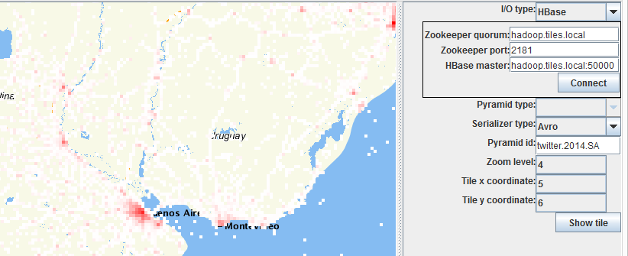

Testing Tiling Job Output
=========================

The Aperture Tiles source code contains a utility for testing the output of tiling jobs. The Bin Visualizer Java application renders basic representations of individual Avro tiles in your tile pyramid. This can help you quickly identify problems with your tiling job before you deploy your application.

**NOTE**: The Bin Visualizer currently only supports heatmap layers.

<h6 class="procedure">To use the Bin Visualizer</h6>

1. Execute the following command in your root aperture-tiles directory to start the Bin Visualizer:

	```bash
	gradlew runBinVisualizer
	```

2. Use the **I/O** type drop-down list to specify the location (HBase or local file system) of your Avro tiles, then enter the appropriate connection details:
	<div class="props">
		<table class="summaryTable" width="100%">
			<thead>
				<tr>
					<th scope="col" width="32%">Storage Location</th>
					<th scope="col" width="36%">Connection Details</th>
					<th scope="col" width="32%">Default</th>
				</tr>
			</thead>
			<tbody>
				<tr>
					<td class="description" rowspan="3">HBase</td>
					<td class="property">Zookeeper quorum</td>
					<td class="value"/>
				</tr>
				<tr>
					<td class="property">Zookeeper port</td>
					<td class="value"/>
				</tr>
				<tr>
					<td class="property">HBase master</td>
					<td class="value"/>
				</tr>
				<tr>
					<td class="description" rowspan="2">Local file system</td>
					<td class="property">Root path</td>
					<td class="value"/>
				</tr>
				<tr>
					<td class="property">Tile extension</td>
					<td class="value">avro</td>
				</tr>
			</tbody>
		</table>
	</div>
4. In the **Pyramid id** field, enter the name of the tile pyramid you want to view.
5. Set the following coordinates to choose the individual tile you want to view:
	<div class="props">
		<table class="summaryTable" width="100%">
			<thead>
				<tr>
					<th scope="col" width="32%">Property</th>
					<th scope="col" width="68%">Description</th>
				</tr>
			</thead>
			<tbody>
				<tr>
					<td class="property">Zoom level</td>
					<td class="description">
						0 is the highest level (most zoomed out),
						<br>1 is one further zoom level down, etc.
					</td>
				</tr>
					<td class="property">Tile x coordinate</td>
					<td class="description">0 is the leftmost column of tiles</td>
				</tr>
				</tr>
					<td class="property">Tile y coordinate</td>
					<td class="description">0 is the bottommost row of tiles</td>
				</tr>
			</tbody>
		</table>
	</div>
6. Click **Show tile**.



If you notice any inconsistencies with the tiled data, you should review your tiling job parameters, fix any errors and run the job again.

## Next Steps ##

For details on customizing an application that creates an interactive visual analytic from your tiled data, see the [Setup the Application](../app-setup/) topic.