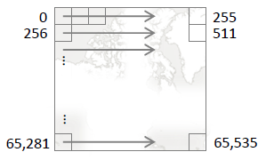

Tile Generation
===============

Using a distributed framework built on the Apache Spark engine, Aperture Tiles enables you to create a set of visual tiles that summarize and aggregate your large-scale data at various levels in a pyramid structure. 

At the highest level in the tile set pyramid (level 0), a single tile summarizes all of your data. On each lower level, there are up to 4^z tiles, where z is the zoom level (with lower numbers indicating higher levels). At each level, the tiles are laid out row wise across the base map or plot, starting at the lower left. Each tile summarizes the data it comprises.

</img>

Each tile is an AVRO record object containing an array of bins (typically 256 x 256). Each bin contains an aggregation of all the data points that fall within it.

</img>

There are three ways to turn your source data into a set of AVRO tiles:

- Using the built-in CSVBinner tool, which can produce tiles that aggregate numeric data by summation or take the minimum or maximum value.
- Creating custom tile-based analytics using the *RDDBinner* APIs.
- Using third-party tools, provided they adhere to the Aperture Tiles AVRO schema. Basic schema files are available in `binning-utilities/src/main/resources`.

##<a name="prerequisites"></a>Prerequisites

###<a name="third-party-tools"></a>Third-Party Tools

See the [Installation documentation](../installation) for full details on the required third-party tools.

- **Languages**:
	- Scala version 2.10.3
- **Cluster Computing**:
	- Apache Spark version 0.9.0 or greater (version 1.0.0 recommended)
      NOTE: In the latest version of Spark, class path issues may arise if you compile Spark from the source code. For this reason, we recommend using one of the pre-built Spark packages.
	- Hadoop/HDFS/HBase (Optional) - Choose your preferred version

###<a name="spark-config"></a>Apache Spark Configuration

Apache Spark must be configured specifically for the version of Hadoop you have installed. [Download the correct version directly](http://spark.apache.org/downloads.html) or, if no version is listed for the correct flavor of Hadoop, [build Spark](http://spark.apache.org/docs/latest/building-with-maven.html) to support your Hadoop version.   

####<a name="spark-script"></a>spark-run Script

The Tile Generator distribution package and the Aperture Tiles source code both contain a **spark-run** script (*bin/**spark-run.sh*** and *aperture-tiles/tile-generation/scripts/**spark-run*** respectively) designed to help you build your own tiles. The script simplifies the process of running Spark jobs by including all the necessary libraries and setting various parameters. 

If you want to use this script, you must first set the following environment variables:

```
SCALA_HOME - the path to the scala installation directory
SPARK_HOME - the path to the spark installation directory
```

Note that in the source code, this script only exists after you build the project. The built script looks for tile generation JAR files in your local maven repository. Therefore, to use this script from the source code, you must first run the following command:

    mvn install

##<a name="tiling-job"></a>Running a Tiling Job

###<a name="csvbinner"></a>CSVBinner

The Aperture Tiles project includes a CSVBinner tool designed to process numeric, character-separated (e.g., CSV) tabular data. The CSVBinner accepts two types of property files to define the tile set you want to create:

- A Base property file, which describes the general characteristics of the data
- Tiling property files, each of which describes the specific attributes you want to tile

Run the tile generation using the **spark-run** script by using a command similar to:

```
spark-run com.oculusinfo.tilegen.examples.apps.CSVBinner -d /data/twitter/dataset-base.bd /data/twitter/dataset.lon.lat.bd
```

Where the -d switch specifies the base property file path, and each subsequent file path specifies a tiling property file.

The CSVBinner creates a collection of AVRO tile data files in the specified location (HBase or your local filesystem).

####<a name="base-properties"></a>Base Property Files

The following properties must be defined in the base property file:

#####Spark Connection Details

```
spark
   Location of the spark master.  Use "local" for spark standalone.
   Defaults to "local".

sparkhome
   Location of Spark in the remote location (and, necessarily, on the local
   machine too). Defaults to the value of the environment variable, SPARK_HOME.

user	(Optional)
   Username passed to the job title so people know who is running the job.
   Defaults to the username of the current user.
```

#####Tile Storage Properties

```
oculus.tileio.type
   Location to which tiles are written:
   - hbase (see HBase properties below for further HBase configuration
     properties)
   - file, to write to the local file system. This is the default.
```

#####HBase Connection Properties

If **oculus.tileio.type** is set to *hbase*, specify the HBase connection configuration properties:

```
hbase.zookeeper.quorum
   Zookeeper quorum location needed to connect to HBase.

hbase.zookeeper.port
   Port through which to connect to zookeeper.

hbase.master
   Location of the HBase master to which to write tiles.
```

#####Source Data Properties

The rest of the configuration properties describe the data set to be tiled.

```
oculus.binning.source.location
   Path (local file system or HDFS) to the source data file or files to be tiled. 

oculus.binning.prefix
   Prefix to be added to the name of every pyramid location. Used to separate
   this tile generation from previous runs. 
   If not present, no prefix is used.

oculus.binning.parsing.separator
   Character or string used as a separator between columns in the input
   data files. Default is a tab.

oculus.binning.parsing.<field>.index
   Column number of the described field in the input data files.
   This field is mandatory for every field type to be used

oculus.binning.parsing.<field>.fieldType
   Type of value expected in the column specified by oculus.binning.parsing
   .<field>.index.

   Default treats the column as containing real, double-precision values. Other
   possible types are:

       - constant or zero
			Contains 0.0 (the column does not need to exist)

       - int
       		Contains integers

       - long
	       	Contains double-precision integers

       - date
	       	Contains dates. Date are parsed and transformed into milliseconds
			since the standard Java start date (using SimpleDateFormatter).
			Default format is yyMMddHHmm, but this can be overridden using the
			oculus.binning.parsing.<field>.dateFormat

       	- propertyMap
	       	Contains property maps. Further information required to retrieve the
			specific property. All of the following properties must be present
			to read the property:
          	
			- oculus.binning.parsing.<field>.property 
             	Name of the property

          	- oculus.binning.parsing.<field>.propertyType
             	Equivalent to fieldType

          	- oculus.binning.parsing.<field>.propertySeparator
             	Character or string used to separate properties

          	- oculus.binning.parsing.<field>.propertyValueSeparator
             	Character or string used to separate property keys from their
             	values

oculus.binning.parsing.<field>.fieldScaling
   How field values should be scaled.

   Default leaves values as they are. Other possibilities are:

   	- log
	   	take the log of the value (oculus.binning.parsing.<field>.fieldBase is
		used, just as with fieldAggregation)

oculus.binning.parsing.<field>.fieldAggregation
   Method of aggregation used on values of the X field. Describes how values from
   multiple data points in the same bin should be aggregated together to create a
   single value for the bin.

   Default is addition.  Other possible aggregation types are:

	- min
		Find the minimum value

	- max
		Find the maximum value

	- log
		Treat the number as a logarithmic value; aggregation of a and b is
		log_base(base^a+base^b). Base is taken from property
		oculus.binning.parsing.<field>.fieldBase, and defaults to e.
```

####<a name="tiling-properties"></a>Tiling Properties File

The properties file defines the tiling job parameters for each layer in your visual analytic, which fields to bin on and how values are binned.

```
oculus.binning.name
   Name (path) of the output data tile set pyramid. If you are writing to a
   file system, use a relative path instead of an absolute path. If you are
   writing to HBase, this is used as a table name. Also written to the tile
   set metadata and used as a plot label.

oculus.binning.projection
   Type of projection to use when binning data.  Possible values are:

   - EPSG:4326
   		Bin linearly over the whole range of values found (default)

   - EPSG:900913
	   Web-mercator projection (used for geographic values only)

oculus.binning.xField
   Field to use as the X axis value.

oculus.binning.yField
   Field to use as the Y axis value. Defaults to none.

oculus.binning.valueField
   Field to use as the bin value. Default is to count entries only.

oculus.binning.levels.<order>
   Array property. For example, if you want to bin levels in three groups, 
   you should include:
   - oculus.binning.levels.0
   - oculus.binning.levels.1
   - oculus.binning.levels.2
   
   Each is a description of the levels to bin in that group - a comma-separated
   list of individual integers, or ranges of integers (described as start-end).
   So "0-3,5" would mean levels 0, 1, 2, 3, and 5. If there are multiple level
   sets, the parsing of the raw data is only done once, and is cached for use
   with each level set. This property is mandatory, and has no default.

oculus.binning.consolidationPartitions
   The number of partitions into which to consolidate data when binning it. 
   If not included, Spark automatically selects the number of partitions.
```

####<a name="examples"></a>Examples

Several example property files can be found in the *aperture-tiles/tile-generation/data* directory.

- **twitter-local-base.bd** is an example base property file for a locally stored dataset of ID, TIME, LATITUDE, LONGITUDE, with the tiles also output to the local file system.
- **twitter-hdfs-base.bd** is an example base property file for the same dataset, but stored in hdfs, and output to hbase.
- **twitter-lon-lat.bd** is an example tiling file that takes either of the base files above, and tells the system to tile levels 0-9 of the longitude and latitude data contained therein.

###<a name="custom-tiling"></a>Custom Tiling

If your source data is not character delimited or if it contains non-numeric fields, you may need to create custom code to parse it and perform tile generation. A good example of custom code for the purposes of tile generation can be found in the Twitter Topics project in *tile-examples/twitter-topics/*, which displays a Twitter message heatmap and aggregates the top words mentioned in tweets for each tile and bin.

In general, creating custom tile generation code involves the following processes:

- Describing Your Data
- Binning Your Data

Once you have written each of the required components, you should run your custom Binner to create a set of AVRO tiles that you will use in your Aperture Tiles visual analytic.

####<a name="describing-your-data"></a>Describing Your Data

The first step in creating a custom tile generation process is deciding how your data should be structured. The following modules are required for this step:

- Binning Analytic
- Serializer

#####Binning Analytic

The Binning Analytic is used throughout the tiling process to define:

- The data format used
- How individual data records in a bin are combined
 
See the following file for an example of a custom Bin Analytic.

```
/tile-examples/twitter-topics/twitter-topics-utilities/src/main/scala/com/oculusinfo/twitter/tilegen/TwitterTopicBinningAnalytic.scala
```

######Types

The Binning Analytic uses two types of data:

- A processing type, which is used when processing the tiles and aggregating them together. It should contain all the information needed for calculations performed during the binning job. The processing type allows you to keep information that may be needed for aggregation, but not needed once the tile is complete.
- A binning type, which is the final form written to the tiles. 

For example, to record an average, the processing type might include the number of records and the total sum of their values, while the binning type would simply be the average.

Another example is shown in line 41 of `TwitterTopicBinningAnalytic.scala`:

```scala
extends BinningAnalytic[Map[String, TwitterDemoTopicRecord], JavaList[TwitterDemoTopicRecord]]
```

Here the processing type is a map used to add all similar topic records together, while the binning type is a list containing only the topics with the highest counts.

The Binning Analytic should also describe how to convert the processing type into the binning type. In `TwitterTopicBinningAnalytic.scala`, this is accomplished with a `finish` function (lines 65-66):

```scala
def finish (value: Map[String, TwitterDemoTopicRecord]): JavaList[TwitterDemoTopicRecord] =
	value.values.toList.sortBy(-_.getCountMonthly()).slice(0, 10).asJava
```

The `finish` function takes the processing type, which maps topics to topic records, finds the 10 most used topics and stores their topic records in order. While the rest of the topics are discarded, they were necessary during processing (e.g., so as to not lose a topic that was eleventh on several different machines -- and hence in the top ten overall).

######Data Aggregation and Record Creation

The Binning Analytic defines how data is aggregated. For example, lines 43-48 of `TwitterTopicBinningAnalytic.scala` compare two maps and create a new map that contains keys that exist in either and the sum of the their values.

```scala
def aggregate (a: Map[String, TwitterDemoTopicRecord],
	           b: Map[String, TwitterDemoTopicRecord]): Map[String, TwitterDemoTopicRecord] = {
	a ++ b.map{case (k, v) =>
		k -> a.get(k).map(TwitterDemoTopicRecord.addRecords(_, v)).getOrElse(v)
	}
}
```

######Calculating Custom Aggregation Methods

Lines 91-109  of `TwitterTopicBinner.scala` (found in the same folder as the Binning Analytic) are used to calculate the minimum and maximum values and write them to the metadata by level. 

```scala
val minAnalysis:
		AnalysisDescription[TileData[JavaList[TwitterDemoTopicRecord]],
					 		List[TwitterDemoTopicRecord]] =
	new TwitterTopicListAnalysis(
		sc, new TwitterMinRecordAnalytic,
		Range(levelBounds._1, levelBounds._2+1).map(level =>
			(level+".min" -> ((index: TileIndex) => (level == index.getLevel())))
		).toMap + ("global.min" -> ((index: TileIndex) => true))
	)

val maxAnalysis:
		AnalysisDescription[TileData[JavaList[TwitterDemoTopicRecord]],
		                    List[TwitterDemoTopicRecord]] =
	new TwitterTopicListAnalysis(
		sc, new TwitterMaxRecordAnalytic,
		Range(levelBounds._1, levelBounds._2+1).map(level =>
			(level+".max" -> ((index: TileIndex) => (level == index.getLevel())))
		).toMap + ("global.max" -> ((index: TileIndex) => true))
	)
```

Standard Bin Analytics are available in:

```
tile-generation\src\main\scala\com\oculusinfo\tilegen\tiling\Analytics.scala
```

####<a name="serializer"></a>Serializer

The Serializer determines how to read and write tiles in a tile set. For the tile server to use, some supporting classes are required.

- Serializer
- Serialization Factory
- Serialization Factory Module
- Serialization Factory Provider 

See the following sections for examples of each custom Serializer component.

#####Serializer

The Serializer implements the `com.oculusinfo.binning.io.serialization.TileSerializer` interface. To read and write the AVRO tiles that are most commonly used, it should inherit from:

- `com.oculusinfo.binning.io.serialization.GenericAvroSerializer` if your bin type is a single record 
- `com.oculusinfo.binning.io.serialization.GenericAvroArraySerializer` if your bin type is an array of records record. 

An example of a serializer of tiles whose bins are an array of records is available in:

```
/tile-examples/twitter-topics/twitter-topics-utilities/src/main/java/com/oculusinfo/twitter/binning/TwitterTopicAvroSerializer.java
```

This class inherits from the `GenericAVROArraySerializer.java` (`/binning-utilities/src/main/java/com/oculusinfo/binning/io/serialization/`) and defines:

- `getEntrySchemaFile`, which points to a file containing the AVRO description of a single record
- `setEntryValue`, which sets the value of one entry in the list from the AVRO file
- `getEntryValue`, which retrieves the value of one entry in the list from the AVRO file

The definition of the AVRO schema is located in the following folder, where the *name* is set to **entryType**.

```
/tile-examples/twitter-topics/twitter-topics-utilities/src/main/resources/twitterTopicEntry.avsc
```

For records that aren't list types, inherit from the `GenericAvroSerializer.java` (`/binning-utilities/src/main/java/com/oculusinfo/binning/io/serialization/`) and define:

- `getRecordSchemaFile`
- `getValue`
- `setvalue`

The definition of the AVRO schema can be based on the template in the following folder, where the *name* is set to **recordType**.

```
/binning-utilities/src/main/resources/doubleData.avsc
```

#####Serialization Factory

The Serialization Factory gets configuration information (e.g., the AVRO compression codec) and hands back the serializer of choice when needed.

```
/tile-examples/twitter-topics/twitter-topics-utilities/src/main/java/com/oculusinfo/twitter/init/TwitterTileSerializationFactory.java
```

#####Serialization Factory Provider

The Factory Provider is an object that produces the factory and can be injected by Guice.

```
/tile-examples/twitter-topics/twitter-topics-utilities/src/main/java/com/oculusinfo/twitter/init/TwitterTileSerializationFactoryProvider.java
```

#####Serialization Factory Module

The Factory Module tells Guice which factory providers to use to create serialization factories.

```
/tile-examples/twitter-topics/twitter-topics-utilities/src/main/java/com/oculusinfo/twitter/init/TwitterSerializationFactoryModule.java
```

####<a name="binning-your-data"></a>Binning Your Data

There are three steps in binning your data:

- Parsing your data into the form required by the Binner
- Running the Binner to transform the data into tiles
- Writing the tiles

See the following file for an example of a custom Binner.

```
/tile-examples/twitter-topics/twitter-topics-utilities/src/main/scala/com/oculusinfo/twitter/tilegen/TwitterTopicBinner.scala
```

#####<a name="parsing-data"></a>Parsing your Data

The Binner expects your data as pairs of `(index, record)`, where:

- `index` is an object indicating where in space the record lies
- `record` is a data record of the processing type your Binning Analytic defines

There are two predefined index types defined by `com.oculusinfo.tilegen.tiling.CartesianIndexScheme` and `com.oculusinfo.tilegen.tiling.IPv4ZCurveIndexScheme` found in:

```
/tile-generation/src/main/scala/com/oculusinfo/tilegen/tiling/RDDBinner.scala
```

With a Cartesian index, the index type is a pair of doubles. With the IPv4 index, the index type is an array of 4 bytes: the 4 values in an IPv4 address. Unless you are tiling against computer addresses, the Cartesian type is preferable. The end result of your parsing will therefore be:

```scala
val data: RDD[((Double, Double), PROCESSING_TYPE)]
```

Where `PROCESSING_TYPE` is the processing type from your Binning Analytic.

Lines 165 - 178 in `TwitterTopicBinner.scala` retrieve the raw data from the Record Parser and create a mapping from (longitude, latitude) pairs to Twitter topic records.

```scala
val data = rawDataWithTopics.mapPartitions(i =>
	{
		val recordParser = new TwitterTopicRecordParser(endTimeSecs)
		i.flatMap(line =>
			{
				try {
					recordParser.getRecordsByTopic(line)
				} catch {
					// Just ignore bad records, there aren't many
					case _: Throwable => Seq[((Double, Double), Map[String, TwitterDemoTopicRecord])]()
				}
			}
		)
	}
)
data.cache
```

#####Binning

Lines 193 - 201 of `TwitterTopicBinner.scala` transform the data into tiles:

```scala
val tiles = binner.processDataByLevel(data,
				                      new CartesianIndexScheme,
				                      new TwitterTopicBinningAnalytic,
				                      tileAnalytics,
				                      dataAnalytics,
				                      tilePyramid,
				                      levelSet,
				                      xBins=1,
				                      yBins=1)
```

Binner.processDataByLevel is defined in the following file on line 237.

```
/tile-generation/src/main/scala/com/oculusinfo/tilegen/tiling/RDDBinner.scala
```

It accepts the following properties:

```
bareData
	A distributed collection of (index, record) pairs as described above.

indexScheme
	Used to convert the index to a set X/Y coordinates that can be plotted. When
	using a CartesianIndexScheme, the coordinates are taken as given.

binAnalytic
	A Binning Analytic that, as described above, defines how to aggregate two
	records, convert them into the form written and determine the extrema of the
	dataset.

tileAnalytics
	Analytics used to perform custom aggregations on tile data (e.g., get the
	minimum and maximum values) and write them to the metadata by level.

dataAnalytics
	Analytics used to perform custom aggregations on raw data that would
	otherwise be lost by the processing type (e.g., recording the maximum
	individual value) and write them to the metadata by level.

tileScheme
	The projection to use to transform from the raw data index into tiles and
	bins. Two types are predefined:
	- /binning-utilities/src/main/java/com/oculusinof/binning/impl/AOITilePyramid,
	  which is a linear transformation into an arbitrarily sized space
	- /binning-utilities/src/main/java/com/oculusinof/binning/impl/
	  WebMercatorTilePyramid, which is a standard geographical projection.

levels
	Specifies which levels to process at the same time. It is generally
    recommended you process levels 1-9 together, then run additional levels	one
	at a time afterward. This arrangement typically makes effective use of
	system resources.

xBins		(Optional)
	Number of bins on the X axis.  Defaults to 256

yBins		(Optional)
	Number of bins on the Y axis.  Defaults to 256

consolidationPartitions		(Optional)
	The number of reducers to use when aggregating data records into bins and
	tiles. Defaults to the same number of partitions as the original data set.
	Alter if you encounter problems with the tiling job due to lack	of resources.

isDensityStrip
	Set to true if running a one-dimentional tiling job. Defaults to false.
```

#####Writing tiiles

Lines 202 - 209 of `TwitterTopicBinner.scala` specify how to write the tiles created from your transformed data.

```scala
tileIO.writeTileSet(tilePyramid,
				    pyramidId,
				    tiles,
				    new TwitterTopicValueDescription,
				    tileAnalytics,
				    dataAnalytics,
				    pyramidName,
				    pyramidDescription)
```

Binner.processDataByLevel is defined in the following file on line 180.

```
/tile-generation/src/main/scala/com/oculusinfo/tilegen/tiling/RDDBinner.scala
```

```
tileScheme
	Type of projection built from the set of bins and levels. Must match the
    tileScheme specified in binner.processDataByLevel.

writeLocation
	The ID to apply to the tile set when writing it. If writing to the local
	filesystem, this will be the base directory into which to write the tiles.
	If writing to HBase, it will be the name of the table to write.

tiles
	The binned data set produced by binner.processDataByLevel.

valueScheme
	The bin descriptor describing the dataset.  This must match the bin
	descriptor used when creating the tiles.

tileAnalytics	(Optional)
	Analytics used to perform custom aggregations on tile data (e.g., get the
	minimum and maximum values) and write them to the metadata by level.

dataAnalytics	(Optional)
	Analytics used to perform custom aggregations on raw data that would
	otherwise be lost by the processing type (e.g., recording the maximum
	individual value) and write them to the metadata by level.

name
	Name of the finished pyramid. Stored in the tile metadata.

description
	Description of the finished pyramid. Stored in the tile metadata. 
```