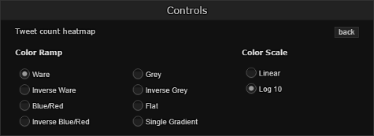

# Interface #

The user interface for a typical Aperture Tiles project contains the following components:

- [Map](#map)
    - [Axes](#axes)
- [Layers](#layers)
    - [Heatmap](#heatmap-layer)
    - [Tile Carousel](#tile-carousel)
    - [Controls](#controls)
- [Description](#description)

## Map ##

The map is the base layer upon which your data is projected. Aperture Tiles supports geographic and cross-plot maps. At each zoom level, the map is automatically scaled to show more or less detail.

The map for the Twitter Topics application is a Google Maps layer that supports nine zoom levels. Numerous geographic features are displayed across the various zoom levels:

- Cities and towns
- International borders
- Major roadways
- Bodies of water
- Basic elevation data

Just like [layers](#layers), the base map can be configured or toggled using the [Controls](#controls) dialog.

### Axes ###

The x and y axes are labeled to describe the units in your base map. Click either axis to show or hide its units.

## Layers ##

In addition to the map (base layer), Aperture Tiles supports various overlays that summarize your data. These layers can be toggled and configured to enable exploration and customization of any subset of data.

Aperture Tiles supports both [heatmap](#heatmap-layer) layers and [tile-based data summary](#tile-carousel) layers. Layers can be configured or toggled using the [Controls](#controls) dialog.

### Heatmap Layer ###

A typical Aperture Tiles project has a heatmap layer showing the concentration of the source data. The heatmap layer in the Twitter Topics application shows the concentration of Twitter messages across South America.

The color of the data points on this layer indicate the concentration of tweets in a geographic region, where red is the lowest density of tweets and yellow is the highest. Click the **Controls** to view the heatmap legend.

While the heatmap in this application shows an aggregation of the individual tweets in a region, other Aperture Tiles applications can be configured to incorporate layers that show only the minimum or maximum value on tile.

### Tile Carousel ###

Each tile in the Twitter Topics application contains a carousel with multiple views that summarize the data contained in each region. As they are highly specific to the source data, each tile carousel implementation generally requires custom coding.

The Twitter Topics carousels let you cycle through the following pages:

<table>
    <thead>
        <tr>
            <th>Word Cloud</th>
            <th>Topic List</th>
            <th>Blank Page</th>
        </tr>
    </thead>
    <tbody>
        <tr>
            <td></td>
            <td></td>
            <td></td>
        </tr>
        <tr>
            <td class="description">Top 10 topics mentioned in tweets. The larger the word, the more times it was used.</td>
            <td class="description">Histograms showing usage of the top 8 topics over the last 24 hours.</td>
            <td class="description">Hide the carousel display for a single tile.</td>
        </tr>
    </tbody>
</table>

Each carousel page also includes a **Translate** button that translates topics to English.

Clicking on a particular topic on any of the carousel pages refreshes the map to:

- Highlight instances of the topic in other tiles to illustrate other locations in which the topic is popular.
- Display a detailed overview of the topic usage, which includes:
    - A total count and expanded histograms of its usage in the past month, week and 24 hours.
    - The most recent tweets in which it appeared.

### Controls ###

The Controls panel is an expandable dialog with configurable settings that let you:

- Hide any of the layers or base map
- Alter the opacity of the layers or base map
- Filter a layer to show only certain concentrations of aggregate data

You can also use the Controls to change the color scheme (ramp) of your heatmap layers by clicking the **Settings** button.

## Description ##

The Description panel is an expandable dialog that briefly defines the source data and its representation in the Aperture Tiles application.

It can also be customized to contain basic controls. In the Twitter Topics application, the Description contains a drop-down list that lets you quickly jump to any of South America's major cities.

## Next Steps ##

For information navigating your data in Aperture Tiles, see the [Navigation](../navigation/) topic.