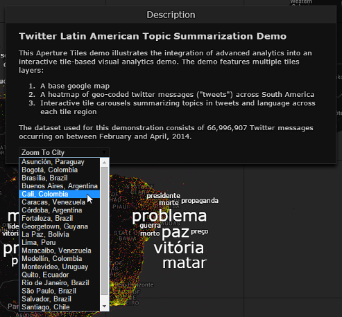

# Navigation #

The Aperture Tiles user interface works much like a modern web-based map system. Your source data is projected on a set of tiles in an x/y cross-plot or a geographic map. In either case, your data is aggregated at several zoom levels so you can view the data at a high level or drill down to see more detailed distribution.

## Zoom ##

<h6 class="procedure">To zoom in on an area you want to investigate</h6>

- Double click on the region, OR 
- Click the **Zoom In**  button in the upper right corner of the map.

<h6 class="procedure">To zoom out</h6>

- Click the **Zoom Out**  button in the upper right corner of the map, OR
- Use the scroll button on your mouse to quickly zoom in or out

### Zoom to City ###

<h6 class="procedure">To quickly zoom to a major city in South America</h6>

1. Click the **Description** control in the upper right corner of the map.

    

2. Select the appropriate city from the **Zoom to City** drop-down list in the project description.

    

The map is redrawn to show the selected city with a zoom factor of five.

**NOTE**: This is customized control that requires specialized code not available in the standard Aperture Tiles template or base libraries.

## Explore ##

<h6 class="procedure">To view other areas of the map</h6>

- Click and drag in the direction you want to move. You can overscroll from the left side of the map to the right and vice versa.

    <h2>Interested in Learning More?</h2>

    <ul>
        <li><a href="../../../tour/">Tour</a>: Take our tour to learn more about Aperture Tiles.</li>
        <li><a href="../../development/getting-started/quick-start/">Documentation</a>: Learn how to install, implement and test your Aperture Tiles applications.
            <ul>
                <li><a href="../../development/getting-started/quick-start/">Quick Start</a>: Our Julia dataset provides an example of the process for generating tiles and visualizing them using Aperture Tiles.</li>
            </ul>
        </li>
        <li><a href="../../../demos/">Live Examples</a>: See our demos page to explore live examples of the capabilities of Aperture Tiles.</li>
        <li><a href="../../../download/">Download</a>: For details on downloading pre-packaged versions or acquiring the Aperture Tiles source code visit our download page.</li>
    </ul>

