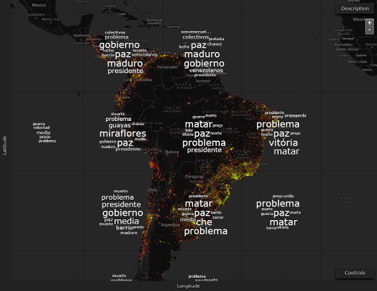

# User Guide #

This page is designed for analysts who want to understand how to navigate the Aperture Tiles user interface and use the application to investigate and assess their own data sources.

**NOTE**: Fully functional example Aperture Tiles applications are available on the the [Demos](../../demos/) page. Copies of some of these demos are also available for your use in the Aperture Tiles source code (in [tile-examples/](https://github.com/unchartedsoftware/aperture-tiles/tree/master/tile-examples)).

## Twitter Latin American Topic Summarization Data ##

The example Twitter Topics application described in this guide explores a heatmap of 66,996,907 Twitter messages originating in South American between February and April, 2014. Tiles at every zoom level contain a carousel that summarizes and overlays the top words used in the tweets in that region.

**NOTE**: The look and feel of each Aperture Tiles application is highly dependent on the source data to which it is configured. While this guide refers to the interface for the Twitter Topics application, many different configurations are available for the display of maps, layers and aggregated data points.

## Next Steps ##

For a detailed description of the Aperture Tiles user interface components, see the [Navigating the Interface](interface/) topics.