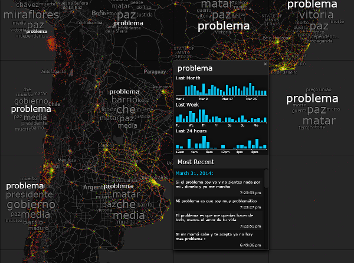
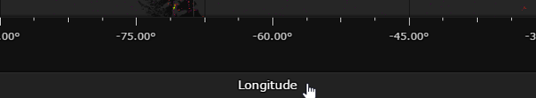

#User Guide

This page is designed for analysts who want to understand how to navigate the Aperture Tiles user interface and use the application to investigate and assess their own data sources.

The look and feel of each Aperture Tiles application is highly dependent on the source data to which it is configured. While the topics in this help system refer to the interface for one specific data set (66,996,907 Twitter messages in South America from February to April, 2014), many different configurations are available for the display of maps, layers and aggregated data points. Such customization options are noted where applicable.

Please note that fully functional example Aperture Tiles applications are available on the the [Demos](../../demos/) page. Copies of these demos are also available for your use in the Aperture Tiles source code.

##Twitter Latin American Topic Summarization Data

The example application described in this User Guide illustrates a heatmap of Twitter messages originating in South American from February to April, 2014. Each tile in the project contains a carousel that summarizes and overlays the top words used in the Tweets covered by that tile. 

</img>

##Interface

The user interface for a typical Aperture Tiles project contains the following components:

- [Map](#int-map)
- [Tile Carousel](#int-carousel)
- [Axes](#int-axes)
- [Description](#int-desc)
- [Controls](#int-controls)

###Map

The map is the canvas upon which your custom data is projected. Aperture tiles supports both geographic and cross plot maps. The map is automatically scaled to show more or less detail depending on the zoom level.

The base map for the Twitter South American data is a Google Maps layer that displays cities and towns, international borders, major roadways, bodies of water and basic elevation data. The project supports nine zoom levels across which varying levels of map detail are displayed. 

###Heatmap Layer

The main layer in the Twitter South American project is a heatmap showing the concentration of tweets across South America. The color of the data points on this layer indicate the concentration of tweets in a geographic region, where red is the lowest density of tweets and yellow is the highest.

</img>

While the tiles in this project aggregate the individual tweets in a region by summation, other Aperture Tiles projects can be incorporate layers that show only the minimum or maximum value on tile.  

###Tile Carousel

Each tile can contain a carousel with multiple views that summarize the aggregate data contained in each tile. As they are highly specific to the source data, each Tile Carousel implementation generally requires custom coding.

In the Twitter South America application, each tile contains a carousel that lets you cycle through:

- A word cloud that shows the top 10 topics mentioned in Tweets covered by the tile. The larger the word, the more times it was used.
	 </img>
- A list of the top 10 topics and a pair of histograms that show their usage over the last month and the last week.
	 </img>
- A blank page that lets you turn off the carousel display for a single tile.

Each carousel page also include a Translate button that translates topics to English.

</img>

Clicking on a particular topic on any of the carousel pages refreshes the map to:

- Highlight instances of the topic in other tiles so you can see other locations in which the topic is popular.
- Display a detailed overview of the topic usage, which includes:
	- A total count and expanded histograms of its usage in the past month, week and 24 hours.
	- The four most recent tweets in which it appeared.

</img>

###Axes

The X and Y axes are labelled to describe the units in your base map. Click either axis to show or hide its units.

</img>

###Description

The Description section is an expandable dialog that provides a summary description of your Aperture Tiles application.

It can also be customized to contain basic controls. In the Twitter Topics application for example, the Description contains a drop-down list that lets you quickly jump to any of South America's major cities.

</img>

###Controls

The Controls section is an expandable dialog that contains configurable settings that let you:

- Hide any of the layers or base map
- Alter the opacity of the layers or base map
- Filter a layer to show only certain concentrations of aggregate data

</img>

You can also use the Controls to change the color scheme (ramp) of your heatmap layers by clicking the **Settings** button.

</img>

##Navigation

The Aperture Tiles user interface works much like a modern web-based map system. Your source data is projected on a set of tiles in an X/Y cross plot or a geographic map. In either case, your data is aggregated at several zoom levels so you can view the data at a high level or drill down to see more detailed distribution.

###Zoom

To zoom in on an area you want to investigate, simply double click on it. Alternatively, you can click the **Zoom In**  button in the upper right corner of the map.  

To zoom out, click the **Zoom Out**  button in the upper right corner of the map.

To quickly zoom in or out, use the scroll button on your mouse.

####Zoom to City

To quickly zoom to a major city in South America:

1. Click the **Description** control in the upper right corner of the map.

	</img>

2. Select the appropriate city from the **Zoom to City** drop-down list in the project description.

	</img>

The map is redrawn to show the selected city with a zoom factor of five.

Note that this is customized control that requires specialized code not available in the standard Aperture Tiles template or base libraries.

###Explore

To view other areas of the map, click and drag in the direction you want to see. Note that you can overscroll from the left side of the map to the right and vice versa.